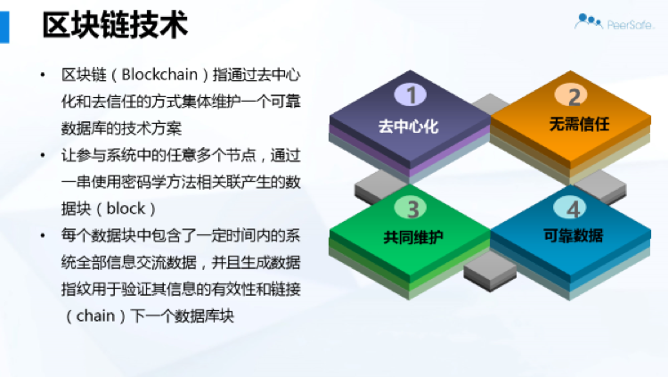
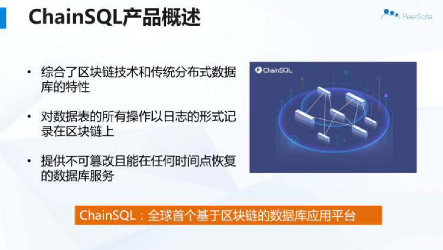
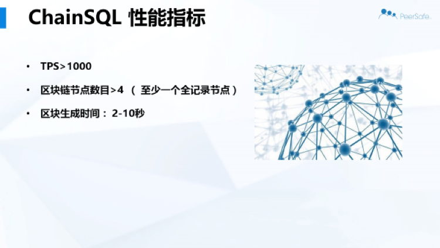
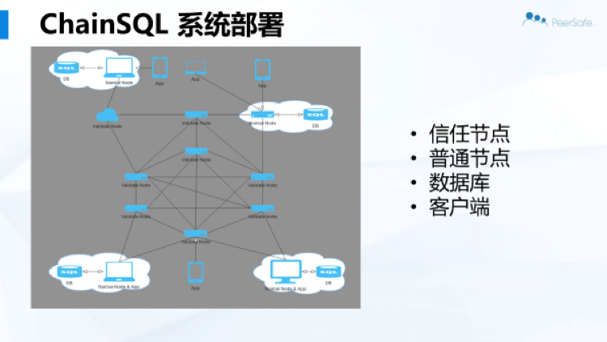
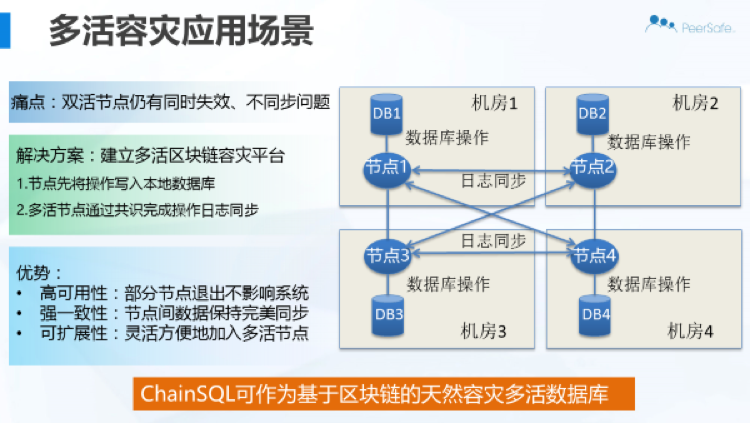
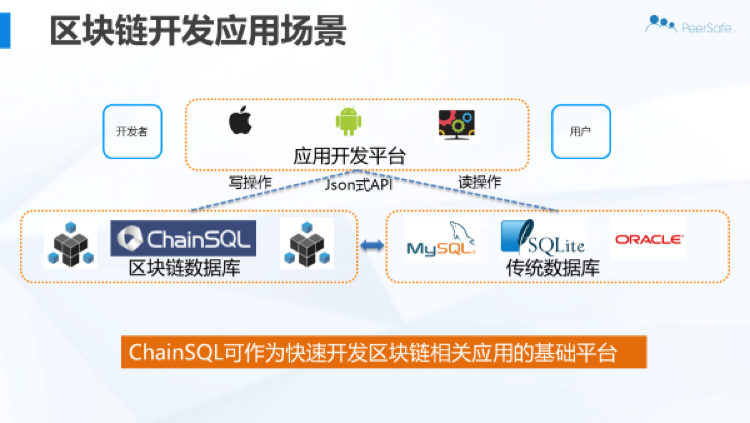

# 区块链数据库 ChainSQL

区块链高级技术专家群内部技术讲座活动。

群内由区块链方向团队或组织的技术专家、学者和负责人等组成，目前仅限邀请加入。

分享内容会在 `TechFirst` 微信公众号进行首发，欢迎关注。

* 时间：2017-01-11，晚 8 点。
* 流程：分享开始后，群内禁言；分享结束后搜集问题，由嘉宾进行统一解答。

## 嘉宾介绍

张治国，现为北京众享比特科技有限公司 CSO，ChainSQL 资深专家。18 年 IT 从业经验，曾就职于深圳金蜘蛛科技有限公司、玛赛网络系统有限公司、亚信科技、日立数据系统有限公司、戴尔中国、北京众享比特科技有限公司。长期致力于为大型企业用户提供业务数据类型分析以及数据存储相关咨询服务，拥有丰富的企业用户 IT 支撑架构设计与咨询相关经验。

## 演讲内容

分享所用的 slides 可以从 [https://github.com/yeasy/blockchain_talk/tree/master/20170111_chainsql/chainsql.pdf](https://github.com/yeasy/blockchain_talk/tree/master/20170111_chainsql/chainsql.pdf) 下载。

!

各位晚上好，我是众享比特的张治国，非常高兴今天跟大家分享众享比特的 ChainSQL 技术。留意到这个群大多数朋友都是对区块链技术的代码比较感兴趣，所以先澄清下，今天跟各位分享的，更侧重于我们的思路、产品的架构和适用场景。

首先简单介绍一下众享比特，我们是成立于 2014 年的 7 月份，最早成立的目的就是致力于分布式系统架构的研发。当时是被 bitcoin、maidsafe 以及 ripple 所激励。觉得在这些技术下蕴含着改变世界的巨大力量。

开始阶段并没有太多的客户需求，我们的目标就集中在拆解这几类技术的代码，尝试将部分功能剥离出来，看是否能与现实中的需求所对应。这个过程中，我们实现了一些去中心分布式的加密通讯协议以及存储技术。并转化为一部分产品。例如沙话（ShadowTalk)。

区块链的市场温度起来以后，我们也接到过许多 POC 的项目，在这个过程中，为了满足不同客户对并发性能或者存储容量的不同需求的场景，我们尝试用各种类型的共识算法去满足客户的业务需求。过程中，体会到了区块链技术对客户现有业务流程带来的潜在的优化和颠覆力量，也觉出要让客户理解并接受这种改变在短期之内是不太现实的，于是我们决定退下来，不再碰客户的业务逻辑，只专注于 IT 层面，用区块链去解决 IT 系统的痛点，其实这个痛点也是业务层面传导过来的痛点。

我们寄希望于可以让客户在可接受的范围内了解和接纳区块链技术，并自发的去思考这个技术会对自身业务流程甚至自身的结构带来的可能改变。也就是我们现在倡导的“+区块链”的概念。现有IT平台中的数据库就是我们尝试解决痛点的对象。

这一页列了一些针对现有中心化结构中的数据库所面临的问题。

这张对群内各位是小儿科了。

此处是 ChainSQL 的三个概述特征，这个片子的内容较早，我们未来会将 ChainSQL 定位成一个技术而非产品，会围绕 ChainSQL 推出系列有针对性的产品。

ChainSQL 的系统架构，其中数据库层的适配我们会继续扩展。共识算法这个模块后续将会根据不同业务需求优化或提供选择。

这里展现了一个 ChainSQL 的工作原理，客户端2将数据写入 ChainSQL，客户端 1 在获得客户端 2 授权的基础上，可将客户端 2 的数据内容异步的恢复至普通数据库。

节点我们提供三种模式：直接共识后入库，预入库后再共识以及节点没有配置传统数据库时数据之落链。通常在异构数据库的环境下我们推荐用预入库方式，而同构的环境不会有问题。节点的不同工作模式，也已提供用户做成同步多活，或者异步容灾备份的业务场景。

这里展示了Chain SQL 的一些相关特点以及简单的应用描述。

这里描述了 Chain SQL 在区块链和传统数据库两者之间找到的技术创新点，以及相关的开发技术重点。图片中的日志并不是传统数据库范畴内的侠义的日志概念，我们目前提供对 SQL 语句的封装以及主动 pull 传统数据库日志独立或组合方式。

这张描述了目前 ChainSQL 的并发性能。这里的 TPS 是传统区块链里的交易的概念，但转换到数据库语言环境下，就是 query 的概念。区块链的一个transaction 对应数据库的一个 query。如何高效的利用现有区块链技术中每一条 transaction 的各种字段，也是我们未来的一个研究课题。

ChainSQL 的基本部署结构。包括信任节点、普通节点、数据库和客户端四种角色。

描述了一个在业务层面能够分区划分的基础上构建的多节点多活互为冗余节点的架构，每个节点在支撑本地生产数据库的同时，也同步的具有从 ChainSQL 重构的其它节点的数据库。

描述了 ChainSQL 作为一个便捷的，在不影响用户现有 IT 架构基础上就可以部署实现的区块链技术，在性能允许的技术上，可实现用户对数据库操作的读写分离。即，写操作在链上，读操作在传统数据库中。

这里描述了 ChainSQL 在解决方案层面的一些优势，或者说能够解决的痛点。包括防篡改性、高可用性、强一致性。

分享就到这里，谢谢大家！

**问：预入库模式下，共识的内容是 DB 日志?**

答：不是。预入库还是我们接口的定义的格式，预入库主要解决的时有些时候sql 版本问题会失败，所以算是尝试下。

**问：是否支持事务？如何解决 SQL 类似回滚这样操作的？**

答：是有条件的，必须配置本地传统数据库，不能有其他分区节点有对同样数据进行修改的请求。我们会在单个的 SQL 操作后附加一个合并的一组操作来通知传统数据库一个事务的 commit 或者没有 commit。

**问：区块链平台和共识算法采用的是哪种？**

答：目前我们采用的是 ripple 的 RPCA。共识算法我们提供模块化，供用户选择。

## 鼓励支持
如果你喜欢讲座分享的内容，欢迎通过如下微信二维码对专家进行支持和鼓励。

===== 关于 TechFirst 公众号 =====

专注云计算、大数据、Fintech、人工智能、分布式相关领域的热门技术与前瞻方向。

发送关键词（如云计算、大数据、容器、区块链），获取热门点评与技术干货。

欢迎投稿！
