## Chaincode实战

### Page 1

Hello，大家好。非常荣幸能被保华大大邀请来到这里跟大家分享我个人对Hyperledger Fabric之上Chaincode开发的一些理解。

简单自我介绍一下，我叫李超，是IBM软件开发部门的一名研发工程师。之所以接触Blockchain技术，一开始完全是由于部门boss的推动，做了一些学习和demo的工作。之后，看到这项技术的火爆，尤其是Hyperledger开源项目的极速发展，个人也就一直在坚持跟踪学习这项技术的最新进展。
这里有我的微信二维码，非常欢迎添加好友多多交流。

好了，进入正题。我今天分享的内容的题目是Chaincode实战。除了介绍Chaincode程序编写、调试的基本方法之外，我还加入了一些有关Chaincode原理的内容，希望能够帮助大家更好地理解Chaincode，进而编写出更加高效的Chaincode程序以及更加快速地调试自己的Chaincode程序。

### Page 2

我把内容分成了四个部分。其中前三部分与fabric 0.6有关，介绍在fabric 0.6的环境之上Chaincode是什么、如何编写Chaincode程序以及如何调试Chaincode程序。中间会穿插与Chaincode相关的重要概念介绍，以及Chaincode运行原理的介绍。

最后一部分则对大家都比较关心的、正处于开发中的fabric 1.0上Chaincode开发进行简单介绍，比如新的架构下Chaincode的运行模型有哪些变化、相关重要概念有哪些以及增加、修改、删除了那些API等。

### Page 3

首先是第一部分内容：在fabric0.6架构之中，Chaincode是什么呢？我觉得可以从以下几个方面来理解。

第一，编写Chaincode程序实际上就是要编写一个类，并且这个类要实现fabric0.6预先定义的一个接口。关于这个接口后面第二部分会有更详细的介绍。

第二，如何运行Chaincode程序呢？我们知道blockchain系统是一个网络，由若干结点构成。Fabric区块链系统也不例外，而要运行Chaincode程序，就要把它首先部署到fabric系统的结点上。也就是说，Chaincode程序是依赖于fabric系统结点的。

第三点和第四点可以放在一块来看。对于一个区块链系统来说，显然，区块链其中是最重要的组成部分。右边这个图展示了最基本的区块链结构：首先区块链是由一个一个的区块串接而成，每个区块又是由若干的Transaction构成。所以，可以说Transaction是一个区块链系统中最基本的组成要素。而在Fabric中，Chaincode的运行是生成Transaction的唯一来源，也因此Chaincode是外界与Fabric区块链交互的唯一渠道。由此可见chaincode的重要性。

最后一点讲的是Chaincode与智能合约的关系。相信大家都听说智能合约的概念，简单来讲智能合约就是用程序实现合约的内容，并且这个程序是事件驱动、有状态的。智能合约是早就出现的概念，早于区块链提出。但是，区块链的出现为智能合约的实现提供了一个非常理想的环境。而在Fabric中，Chaincode就是开发者实现智能合约的方式。

### Page 4

这一页是与Chaincode相关的两个比较重要的概念。

首先是Transaction。Transaction是比较通用的概念，在很多其它系统中都有，比如数据库，但是在Fabric中特指一次Chaincode的执行。在fabric0.6中，定义了五类transaction，除了其中一类是Undefined之外，其余四类斗鱼Chaincode执行有关。另外，在fabric的实现中，transaction实际上是一个结构体，里面存储了这次chaincode执行的相关信息，比如chaincodeID、函数名称、输入参数等，但并不包含所操作的数据。这个数据是指什么呢？比如你编写了一个类似比特币的chaincode，那么其中的数据就有可能是指账户及其对应的余额。

既然Transaction中不包含数据，也就是说blockchain上并不存储数据，那么就需要一个地方来存储数据。这就引出了另外一个概念——worldstate。

对于刚接触这个概念的人来说，可能不太好理解。简单来讲，它表示的是整个Fabric区块链系统中所有变量和值的集合。这里变量和值是指什么呢？这于fabric的存储机制有关。Fabric0.6中使用RocksDB来存储数据，而RocksDB是一个key-value的数据库，这里key就对应上面的变量，value就对应上面的值。Fabric就将每一对这样的key-value叫做一个state，而整个Rocksdb中所有的键值对的集合就叫worldstate。

### Page 5

这是fabric0.6对chaincode开发情况的支持。

在开发语言上，fabric0.6支持go和Java两种语言来编写chaincode程序。我下面是以go语言为例来介绍chaincode的编写的。

关于SDK，如果使用vagrant方式搭建自己的fabric开发环境的话，在你的这条路径下，$GOPATH/src/github.com/hyperledger/fabric/core/chaincode/shim，就是chaincode开发的SDK。

### Page 6

接下来是第二部分，如何编写Chaincode。

前面提到编写chaincode就是实现一个接口，这里就是那个接口的定义。
可以看到这个接口定义了三个方法，每个方法分别具有不同的作用，并且它们的运行分别对应一类不同的Transaction。

首先，Init方法会在Deploy chaincode时被调用，并且它的执行会生成Deploy transaction。因此，一般在其中完成一些初始化工作，并且仅被执行一次。

Invoke方法会在Invoke chaincode时被调用，它的执行会生成Invoke transaction。其中的代码可以更新worldstate，并且可被多次调用。

Query方法会在Query chaincode时被调用，它的执行会生成Query transaction。但是其中的代码只能查询worldstate，否则会报错。该方法也可以被多次调用。

前面也提到Chaincode的执行会对应四类的transaction，除了上面三类之外，还有一类是Terminate transaction，是在chaincode终止时生成。

### Page 7

这一页是使用go语言编写chaincode时的一个最基本的框架。

可以看到，最主要的是编写自己的chaincode类，实现刚刚看到的三个方法。然后在main函数中通过API shim.start()来向特定peer结点注册该chaincode。

那么如何使用相关的API呢？两种方式，一种是通过参数stub shim.ChaincodeStubInterface，fabric在该接口中定义了丰富的API；此外，fabric也定义了一些全局的函数可悲使用，比如这里的start()函数就是其中之一。

### Page 8

那么，先看ChaincodeStub提供了那些API。我将这些API分成了五大类。

第一大类与state操作相关。通过这些API可以根据key来查询/添加/更新相应的state，此外，你也可以按照字典序获取某一范围内的key-value集合。

第二大类与表的操作相关，fabric支持整表操作，也支持单行、多行操作。这里要说一下，fabric使用key-value的rocksdb存储数据，而rocksdb并不支持表的操作，所以，这里的API实际上是fabric封装出来的，底层依然会转成key-value进行读写。所以，如果使用这类API时，可能需要考虑性能的问题。
第三类是与chaincode间相互调用有关的两个API。Fabric允许在一个chaincode中根据chaincode name去Invoke和query另一个chaincode。可以看到并没有deploy的API，也就是说，fabric不允许在一个chaincode中去部署新的chaincode。

### Page 9

第四大类与Transaction有关。这一大类全是读操作。前面提到Transaction实际上是一个结构体，里面存储了很多的信息，这一大类API就允许你读出其中的这些信息。

最后一大类只有一个API，SetEvent。Fabric允许开发者定义自己的event，然后这个event会在transaction写进block时触发，因此开发者就可以自己写相应的event handler程序做一些相关的工作。

### Page 10

此外就是一些全局的或辅助的API。

比如刚才看到的Start函数，它向指定的peer结点注册chaincode。

辅助类都是与前面的state或table操作相关的API有关。

关于API的详细说明可以打开这个链接看到。但是上面基于的是最新的fabric实现，所以跟刚才讲的会有很多不同。具体以你使用fabric版本为准。

### Page 11

第三部分讲的是如何调试chaincode。

在介绍具体调试步骤之前，我想先介绍一下chaincode运行的基本原理，我觉得这有助于chaincode的开发。

首先，fabric peer结点有两种运行模式。一种是一般模式，在这种模式下chaincode运行在Docker容器中。这也是fabric在production环境下的运行模式。这就相当于给chaincode的运行提供了一个相对隔离的环境，这样整个系统也就更加的健壮。但是在这种模式下，调试过程就变得非常复杂。因为一旦调试过程中发现bug，重新修改代码后就要重新build Docker image，然后重新部署。而Docker image的部署是比较耗时的。

所以，针对这个问题，fabric又提供了开发模式。在这种模式下chaincode直接运行在本地，这样chaincode的调试过程就与普通程序的调试过程完全一样，因此开发调试过程就更加容易。

### Page 12

这个图描述的是开发模式下chaincode注册时的执行过程。

首先，chaincode会向指定的peer结点发送相关信息，比如chaincode name。然后，peer结点会做一些检查，主要是看该chaincode name是否已存在。如果不存在，则注册成功，返回相关信息。此后，chaincode就与peer结点建立起了联系，二者始终处于互相监听状态。

### Page 13

这个图描述的是开发模式下chaincode deploy/invoke/query时的运行过程。

首先，通过CLI或App向指定peer结点发送deploy/invoke/query请求。
Peer接收到请求之后，如果相关chaincode存在，就会组装相应的transaction，并发送给相应的chaincode。
Chaincode端接收到transaction之后，会首先对其解析，确定要执行的函数，然后开始执行该函数。由于执行过程中，可能涉及到多次的worldstate的读写，而每一次的读写都会有rocksdb的操作，所以这个过程会涉及到多次与peer结点的通信。
最后，chaincode执行完毕之后，会发送消息给peer结点，如果执行成功，peer结点就会将transaction写进block，并发送消息给CLI/App端。

### Page 14

这是在开发模式下，未启用CA时chaincode调试的基本步骤。
都比较直观，没有太多要注意的地方。

### Page 15

然后就可以通过deploy、invoke、query命令来调试相关函数了。

### Page 16

下面简单介绍一下fabric1.0中与chaincode编写相关的一些内容，包括基本概念、transaction Flow、相比fabric0.6 API的变化，以及chaincode调试的步骤。

首先是四个概念，也是四个角色。

Channel是1.0增加的一个比较大的feature。简单理解，可以把它当做是子链的概念。在新的架构下，同一个peer结点可以加入不同channel。这样chaincode部署时只需向其中一个结点部署即可。
Endorser、Orderer、Committer是将原来0.6中VP的功能进行拆分后产生的三个角色。

Endorser结点会模拟执行chaincode，这样就相当于把计算任务从consensus结点独立出来，进而减轻了consensus结点的负担，也就可以增加系统吞吐量。同时，比较重要是fabric1.0可以支持endorsement policy，即一个transaction的提交需要哪些endorser进行背书才可通过。这样整个系统的访问控制就更加灵活。

Orderer结点的工作就是consensus。Chaincode在endorser结点处执行之后，会被发送给orderer进行排序或者说consensus，保证transaction的顺序是一致的。然后，orderer结点会把transaction发送给相应的channel中的所有committer结点。
Committer结点会将接收到的transaction写进block。

### Page 17
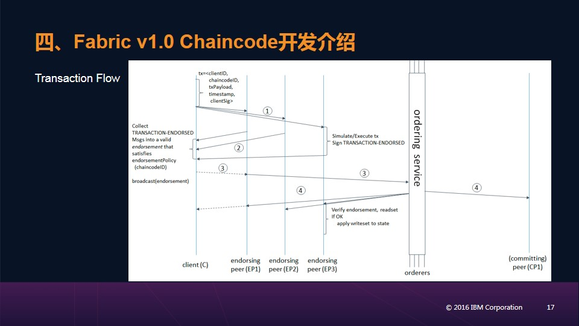

这是一个transaction执行过程的时序图。

以chaincode invocation为例。首先，client端会收集相关信息，比如chaincodeID、签名等信息，构造出invoke proposal，并将其发送至约定的endorser结点。在这个图中有三个endorser结点。每个endorser结点单独运行相应的chaincode。并对结果进行签名。执行完成后，会把结果以response的形式返回给client端。然后，Client端在收到足够的endorser响应之后会向orderer结点发送ordering请求。Orderer结点会根据endorsement policy验证是否能够将transaction写进block。如果通过，它会向channel上所有的committer结点发送消息，告诉它们可以将transaction写进block，也同时会返回结果消息给client端。至此，整个过程执行完毕。

由图可知，endorser可以作为committer，但不是所有committer都是endorser。

### Page 18
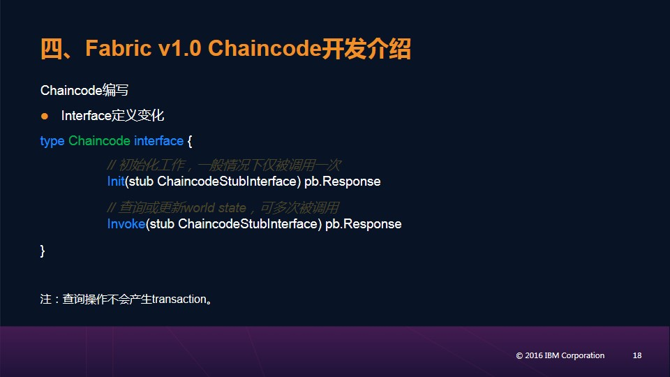

下面看一下1.0中chaincode编写的一些变化。

首先是Chaincode接口的定义发生了变化。去掉了原来的Query方法，将它的功能整合进了Invoke方法。另外，剩下的两个方法的接口定义也有些变化，输入参数仅剩ChaincodeStub，所以在编写chaincode时就要通过stub提供的API来获取相应的输入参数。同样地，在1.0中query操作依然不会生成transaction。

### Page 19
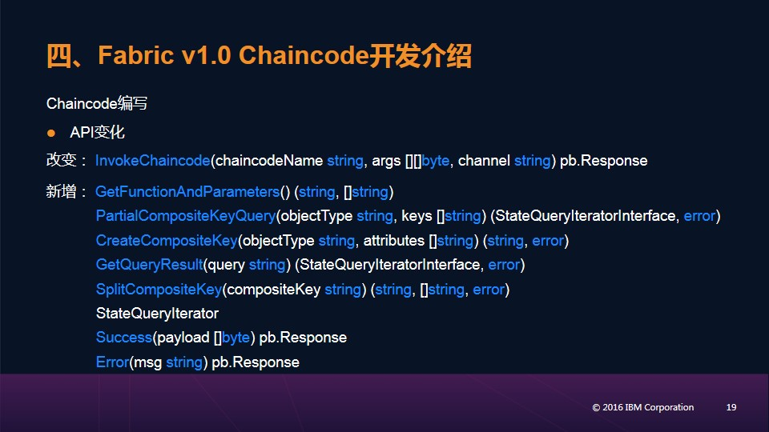

然后看一下ChaincodeStub中API的变化。

首先，有一个接口方法的定义发生了改变，即InvokeChaincode，它允许在一个chaincode中调用另一个chaincode。输入参数上增加了channel，用于指定要调用的chaincode位于哪个channel中；返回值也从原来的[]byte变成了一个特定的类型pb.Response。

然后为了支持新的功能，fabric1.0新增了若干的API。

比如fabric1.0支持新的composite key查询的操作，因此新增了相应的API；比如fabric1.0允许直接使用底层使用的db所支持的语法来进行查询，所以新增了GetQueryResult方法等。

### Page 20
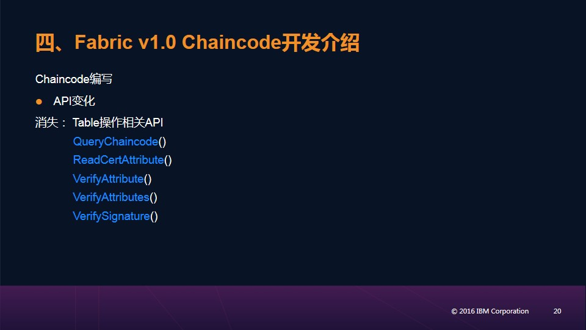

还有一些原来0.6中有的API被删除了。
比如所有与表操作相关的API、Attribute相关的API等。

### Page 21
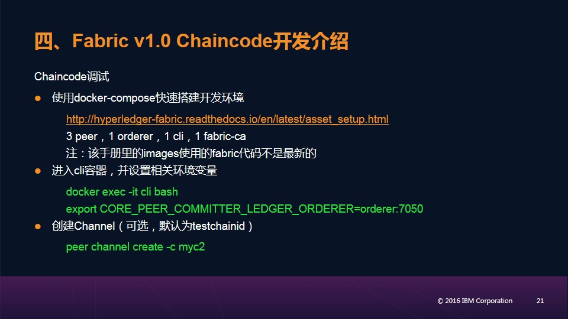

下面是CLI模式下fabric1.0调试chaincode的基本步骤。

这里使用的是通过Docker-compose搭建而成的fabric1.0运行环境。这个网页上有给出搭建步骤，过程非常简单。
搭建完成之后环境有3个peer结点、1个orderer结点、1个CA结点、一个cli结点。其中CLI结点（容器）特别用于执行CLI命令。

然后就可以通过以下步骤来运行调试chaincode代码。过程与fabric0.6基本类似，只有一点不同，就是需要先创建channel，然后将相关peer结点join进该channel，之后deploy和invoke时就需要指定该channel。

当然也可以完全按照0.6中的步骤去做，这样chaincode的执行实际上是执行在一个叫做testchainID 的默认channel上，而所有peer结点都在该channel上。

### Page 22
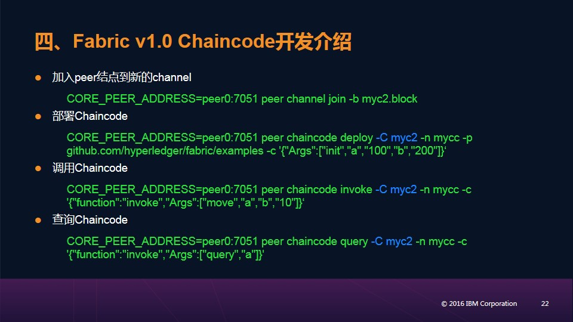

这是后续步骤。过程都比较直观，没有太多需要注意的地方。

### Page 23
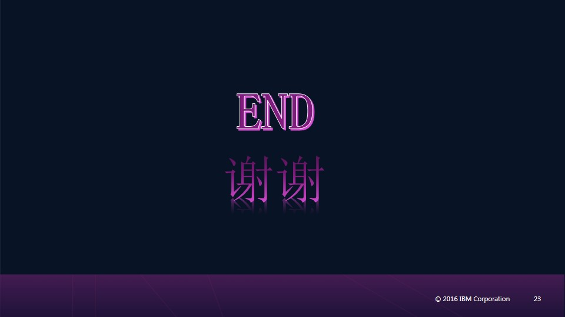

我的share到此结束，谢谢大家观看。

另外，我在后面有几页附录，主要是把上面Docker-compose文件中的内容拆分成单独的步骤。之所以这么做，主要是因为在docker-compose方式搭建的环境中，无法看到各个结点打印的log信息，对于调试过程很不方便。分解成单独的步骤之后，每一步就可以在单独的shell下运行，也就能够看到相应的log信息。仅供参考。

再次对大家的观看表示感谢。

### Page 24
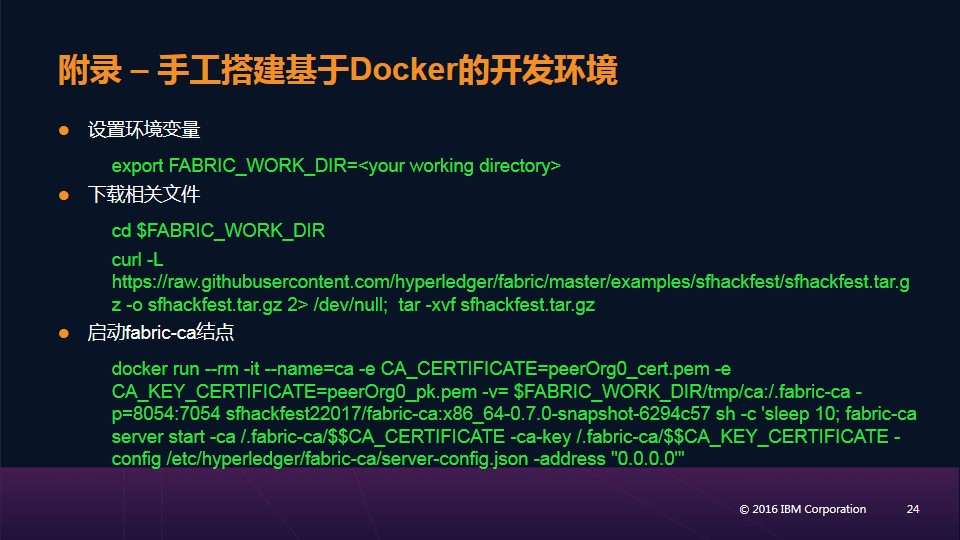

### Page 25
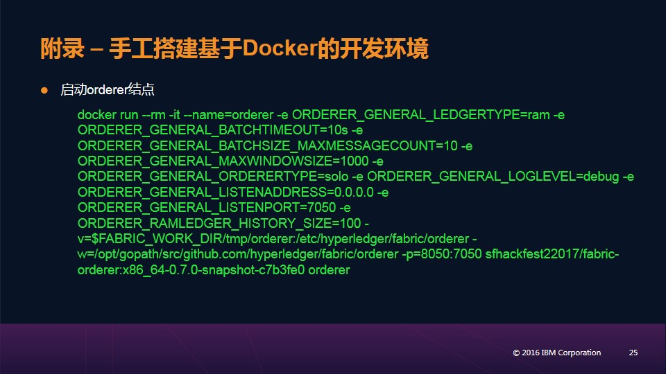

### Page 26
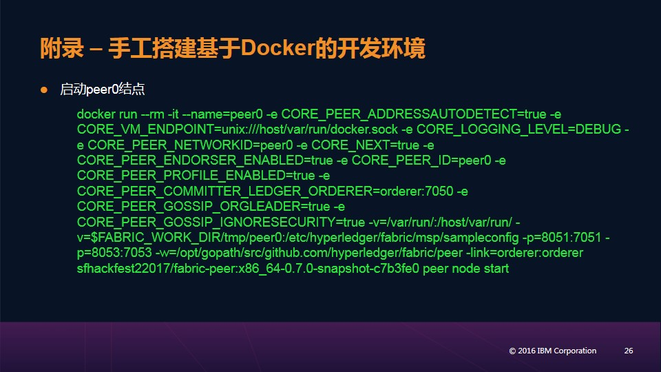

### Page 27
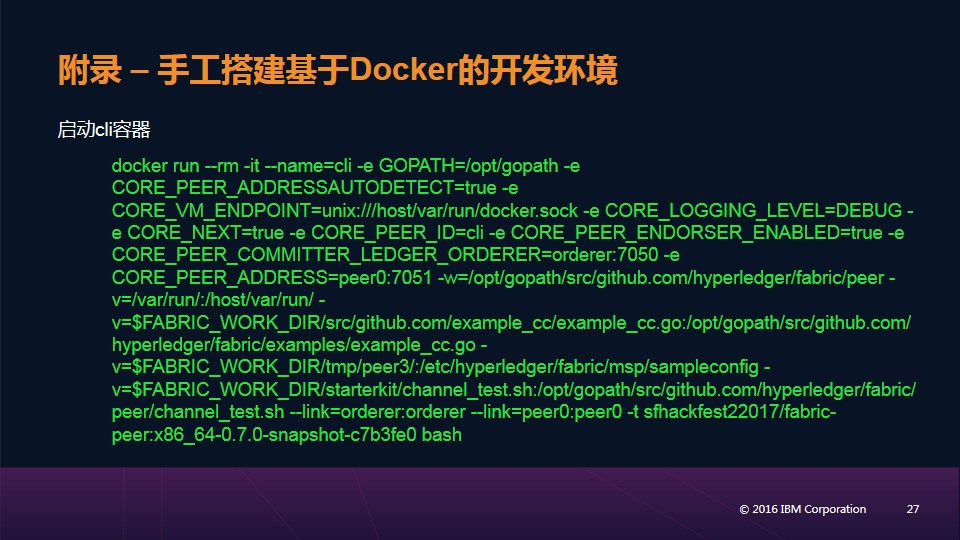

