## Fabric1.0 Chaincode Intro

### Page 1
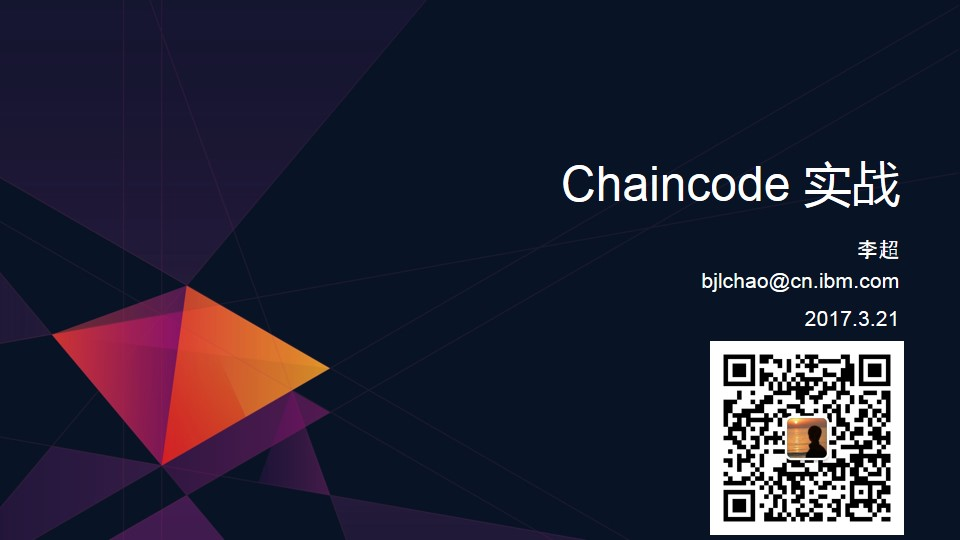

Hello，大家好。非常荣幸能被保华大大邀请来到这里跟大家分享我个人对Hyperledger Fabric1.0之上Chaincode开发的一些理解。

简单自我介绍一下，我叫李超，是IBM软件开发部门的一名研发工程师。之所以接触Blockchain技术，一开始完全是由于部门boss的推动，做了一些学习和demo的工作。之后，看到这项技术的火爆，尤其是Hyperledger开源项目的极速发展，个人也就一直在坚持跟踪学习这项技术的最新进展。
这里有我的微信二维码，非常欢迎添加好友多多交流。

好了，进入正题。我今天分享的内容的题目是Fabric1.0 Chaincode介绍。除了介绍Chaincode程序编写、调试的基本方法之外，我还加入了一些有关Chaincode原理的内容，希望能够帮助大家更好地理解Chaincode，进而编写出更加高效的Chaincode程序以及更加快速地调试自己的Chaincode程序。

### Page 2
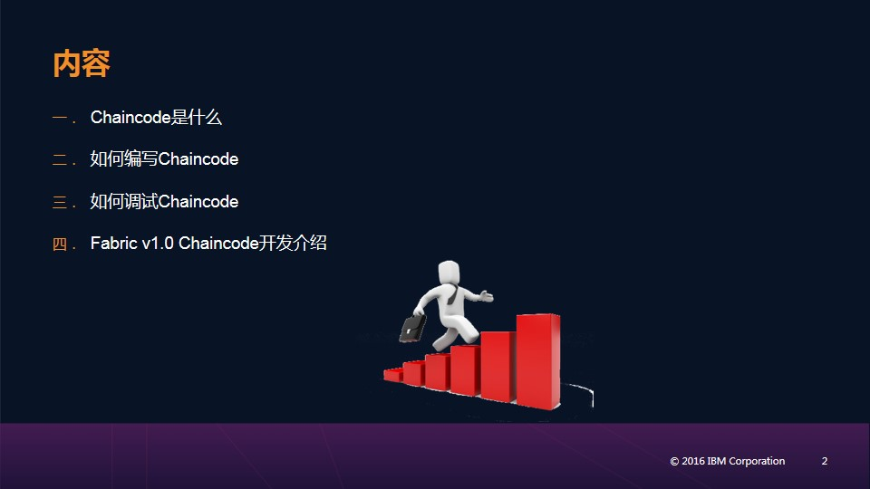

我把内容分成了三个部分。内容包括：在fabric 中Chaincode是什么、如何编写Chaincode程序以及如何调试Chaincode程序。中间会穿插与Chaincode相关的重要概念介绍，以及Chaincode运行原理的介绍。

### Page 3

首先是第一部分内容：在fabric中，Chaincode是什么呢？我觉得可以从以下几个方面来理解。

第一，编写Chaincode程序实际上就是要编写一个类，并且这个类要实现fabric预先定义的一个接口。关于这个接口后面第二部分会有更详细的介绍。

第二，如何运行Chaincode程序呢？我们知道blockchain系统是一个网络，由若干结点构成。Fabric区块链系统也不例外，而要运行Chaincode程序，就要把它首先部署到fabric系统的结点上。也就是说，Chaincode程序是依赖于fabric系统结点的。

第三点和第四点可以放在一块来看。对于一个区块链系统来说，显然，区块链其中是最重要的组成部分。右边这个图展示了最基本的区块链结构：首先区块链是由一个一个的区块串接而成，每个区块又是由若干的Transaction构成。所以，可以说Transaction是一个区块链系统中最基本的组成要素。而在Fabric中，Chaincode的运行是生成Transaction的唯一来源，也因此Chaincode是外界与Fabric区块链交互的唯一渠道。由此可见chaincode的重要性。

最后一点讲的是Chaincode与智能合约的关系。相信大家都听说智能合约的概念，简单来讲智能合约就是用程序实现合约的内容，并且这个程序是事件驱动、有状态的。智能合约是早就出现的概念，早于区块链提出。但是，区块链的出现为智能合约的实现提供了一个非常理想的环境。而在Fabric中，Chaincode就是开发者实现智能合约的方式。

### Page 4
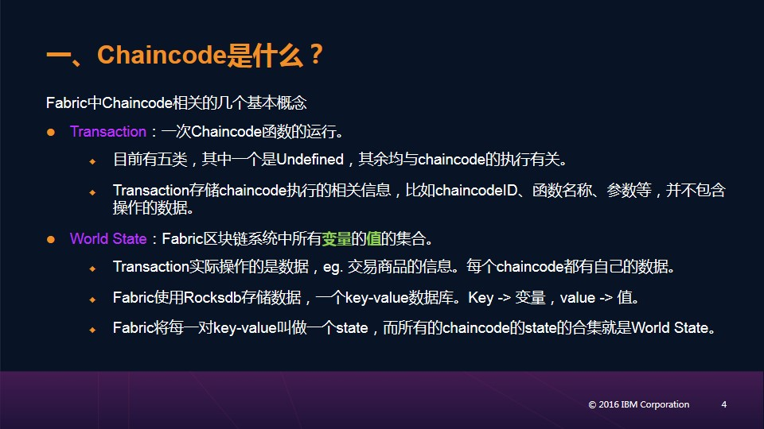

这一页是在fabric1.0中与Chaincode相关的几个比较重要的概念。

Channel是1.0增加的一个比较大的feature。字面意思，通道。流过通道的数据对于加入该通道的结点是共享的。因此，对于加入同一通道的结点来说，就相当于构建了一条子链。这条子链上的内容对于通道外的结点是不可知的。并且，同一个peer结点可以加入不同channel。而Chaincode的执行是基于channel进行的，在一条channel上chaincode执行的结果会被该channel上所有的结点同步到本地Ledger中。

然后是Endorser、Orderer、Committer，它们是将原来0.6中VP的功能进行拆分后产生的三个角色。

Endorser结点会模拟执行chaincode，这样就相当于把计算任务从consensus结点独立出来，进而减轻了consensus结点的负担，也就可以增加系统吞吐量。同时，比较重要是fabric1.0可以支持endorsement policy，即一个transaction的提交需要哪些endorser进行背书才可通过。这样整个系统的访问控制就更加灵活。

Orderer结点的工作就是consensus。Chaincode在endorser结点处执行之后，会被发送给orderer进行排序或者说consensus，保证transaction的顺序是一致的。然后，orderer结点会把transaction发送给相应的channel中的所有committer结点。

Committer结点会将接收到的transaction写进block。

### Page 5
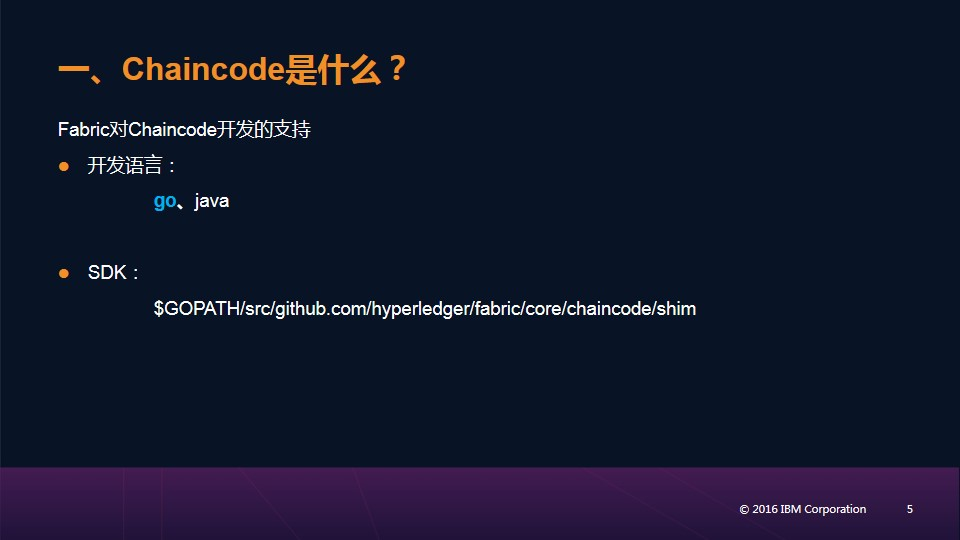

这是fabric1.0对chaincode开发情况的支持。

在开发语言上，支持go和Java两种语言来编写chaincode程序。我下面是以go语言为例来介绍chaincode的编写的。

关于SDK，如果使用vagrant方式搭建自己的fabric开发环境的话，在你的这条路径下，$GOPATH/src/github.com/hyperledger/fabric/core/chaincode/shim，就是chaincode开发的SDK。

### Page 6
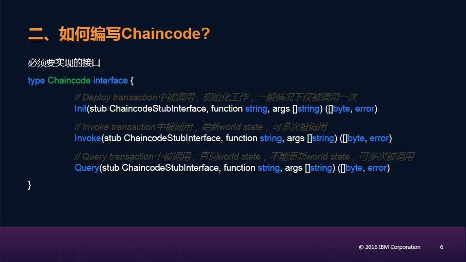

接下来是第二部分，如何编写Chaincode。

前面提到编写chaincode就是实现一个接口，这里就是那个接口的定义。
可以看到这个接口定义了两个方法，分别具有不同的作用。

首先，Init方法会在Instantiate  chaincode时被调用。因此，一般在其中完成一些初始化工作，并且仅被执行一次。

Invoke方法会在Invoke或Query chaincode时被调用。其中的代码可以查询或更新底层的数据，并且可被多次调用。

### Page 7
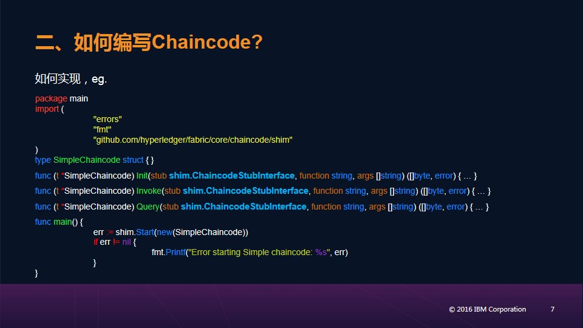

这一页是使用go语言编写chaincode时的一个最基本的框架。

可以看到，最主要的是编写自己的chaincode类，实现刚刚看到的两个方法。然后在main函数中通过API shim.start()来向特定peer结点注册该chaincode。

那么如何使用相关的API呢？两种方式，一种是通过参数stub shim.ChaincodeStubInterface，fabric在该接口中定义了丰富的API；此外，fabric也定义了一些全局的函数可被使用，比如这里的start()函数就是其中之一。

### Page 8
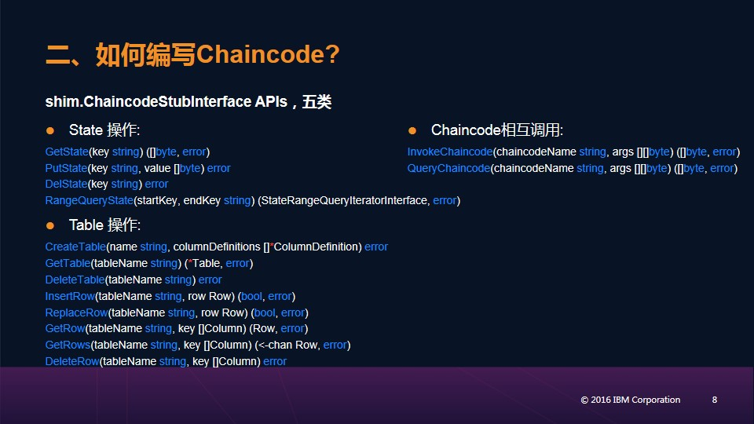

那么，先看ChaincodeStub提供了哪些API。我将这些API分成了五大类。

第一大类与state操作相关。通过这些API可以根据key来查询/添加/更新相应的state。这些API提供了单key的读写操作、key字典序范围读取操作、composite key读取操作、底层数据库语法的查询操作等。

第二大类与与参数相关。fabric1.0修改了chaincode接口的定义，需要开发者自己调用API获取传入的参数。注意，传入的参数第一个是函数名称，之后才是相应的函数输入参数。

### Page 9
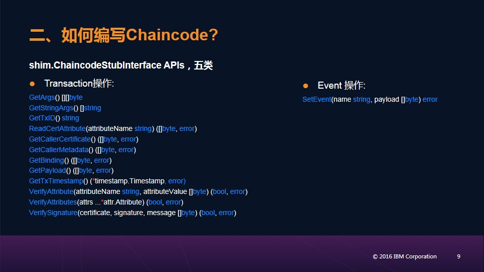

第三大类与Transaction有关，并且这一类都是读操作，读取transaction中各种信息，比如transaction id、timestamp等。

第四类是与chaincode间相互调用有关的一个API。Fabric允许在一个chaincode中根据chaincode name和channel name去调用另一个chaincode。可以看到并没有deploy的API，也就是说，fabric不允许在一个chaincode中去部署新的chaincode。

最后一类也只有一个API，SetEvent。Fabric允许开发者定义自己的event，然后这个event会在transaction写进block时触发，因此开发者就可以自己写相应的event handler程序做一些相关的工作。

### Page 10
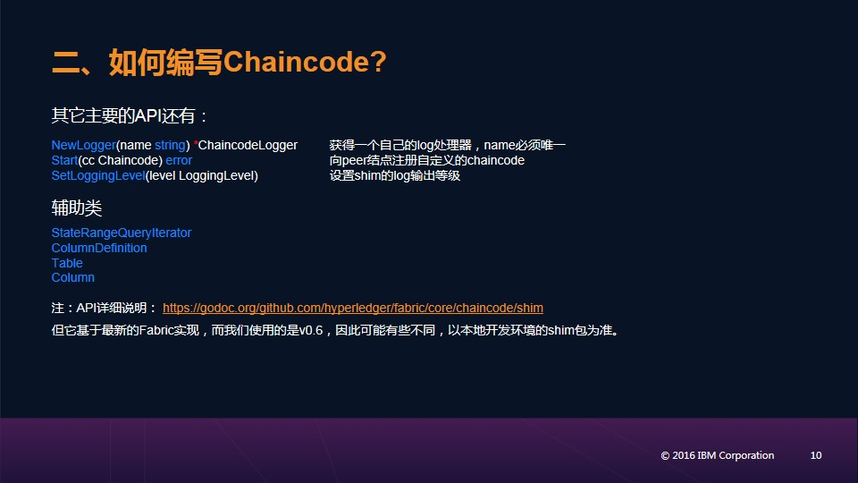

此外就是一些全局的或辅助的API。

比如刚才看到的Start函数，它向指定的peer结点注册chaincode。

辅助类StateRangeQueryIterator与前面state范围查询的API有关。

关于API的详细说明可以打开这个链接看到。但是上面基于的是最新的fabric实现，所以跟刚才讲的会有很多不同。具体以你使用fabric版本为准。

### Page 11
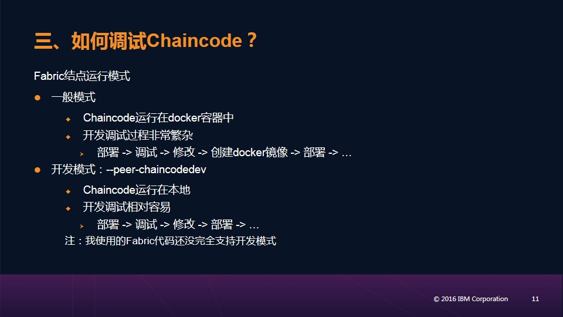

第三部分讲的是如何调试chaincode。

在介绍具体调试步骤之前，我想先介绍一下chaincode运行的基本原理，我觉得这有助于chaincode的开发。

首先，fabric peer结点有两种运行模式。一种是一般模式，在这种模式下chaincode运行在Docker容器中。这也是fabric在production环境下的运行模式。这就相当于给chaincode的运行提供了一个相对隔离的环境，这样整个系统也就更加的健壮。但是在这种模式下，调试过程就变得非常复杂。因为一旦调试过程中发现bug，重新install，然后重新部署。而在这个过程中，install和Docker image的build过程都比较耗时。

所以，针对这个问题，fabric又提供了开发模式。在这种模式下chaincode直接运行在本地，这样chaincode的调试过程就与普通程序的调试过程完全一样，因此开发调试过程就更加容易。

要说明的是，我目前看的fabric1.0的代码对于开发模式的支持还不完备，部署的时候回失败。

### Page 12
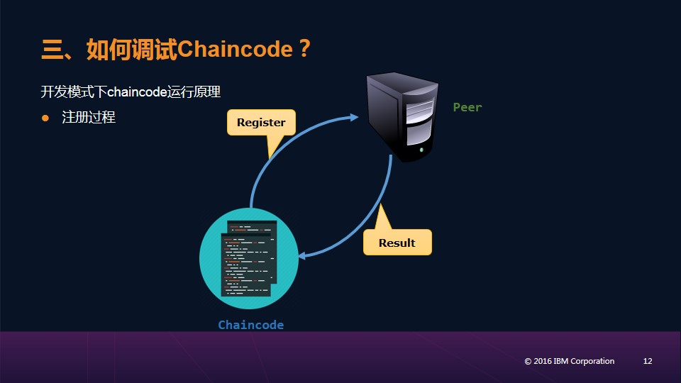

但是因为开发模式的原理比较容易理解，这里我还是以开发模式为例介绍一下chaincode的运行原理。一般模式下，只需将chaincode的运行放在Docker容器中进行理解。

首先，这个图描述的是开发模式下chaincode注册时的执行过程。

首先，chaincode会向指定的peer结点发送相关信息，比如chaincode name。然后，peer结点会做一些检查，主要是看该chaincode name是否已存在。如果不存在，则注册成功，为其创建相应的handler，然后返回相关信息。此后，chaincode就与peer结点建立起了联系，并且二者始终处于互相监听状态。

### Page 13
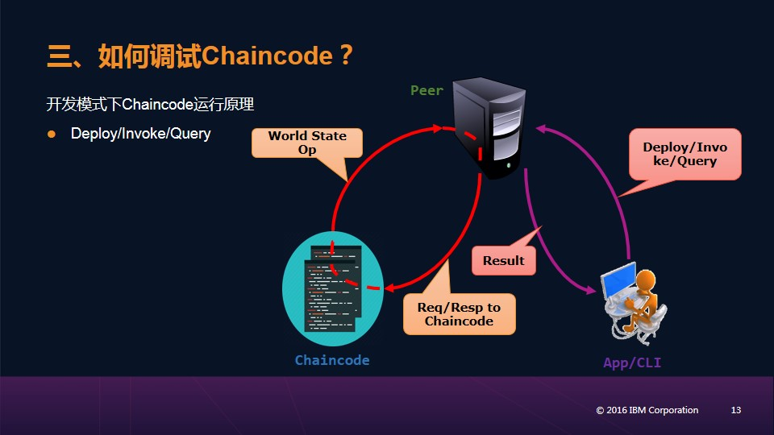

这个图描述的是开发模式下chaincode Instantiate/invoke/query时的运行过程。

首先，通过CLI或App向指定endorser结点发送Instantiate/invoke/query请求。
endorser接收到请求之后，如果相关chaincode存在，就会将请求发送到chaincode端，并执行相应函数。由于执行过程中，可能涉及到多次的state的读写，而每一次的读写都会涉及到底层db的操作，所以这个过程会涉及到多次与endorser结点的通信。

最后，chaincode执行完毕之后，会发送消息给endorser结点。如果执行成功，endorser结点就会封装执行结果并对其endorse，并把结果返回给CLI/APP端，然后进行ordering。这个图里没有给出ordering和committing的过程。

### Page 14
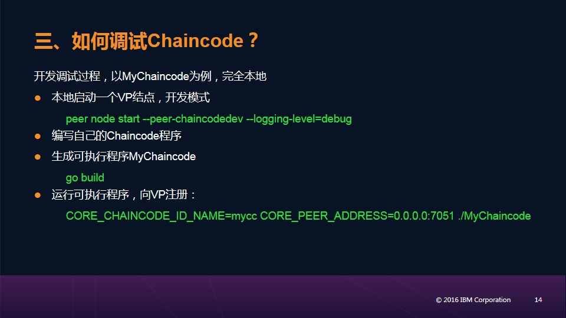

这里给出一般模式下Chaincode的开发调试过程。以fabric chaincode_example02为例，完全本地，并且使用fabric默认配置。我的环境是使用vagrant方式搭建的。

首先，启动orderer结点，运行在solo模式下。

然后，本地启动一个peer结点，指定peer的名称。

然后，install chaincode程序，指定chaincode的名称以及version，它们将用于命名build出来的docker image。默认配置下，需要你的chaincode程序位于GOPATH/src路径下，并且这个命令会将GOPATH/src下的几乎所有文件都打包发送到指定的peer结点。

### Page 15
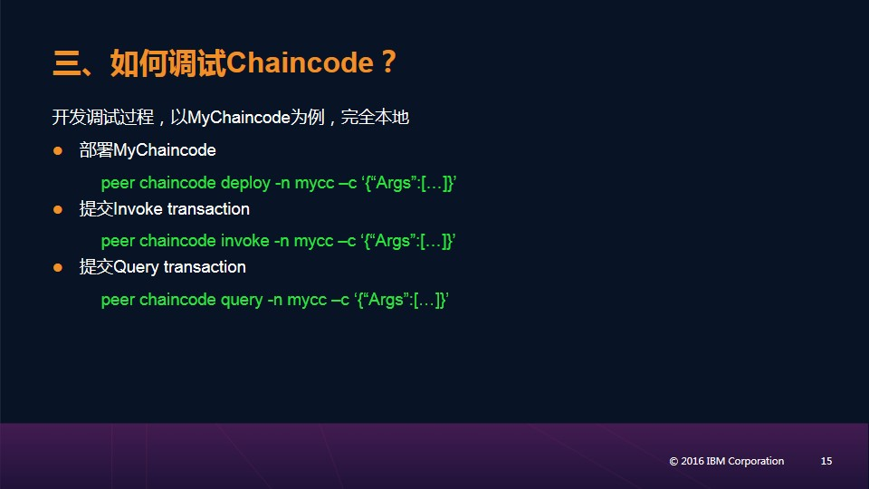

接下来，通过Instantiate命令部署刚刚install的chaincode，同样需要给出chaincode名称和version。channel的名称是可选的，如果省略将默认使用testchainid这个channel，peer启东时会默认加入这个channel。

之后，就可以通过invoke和query命令来调试自己的chaincode程序了。这里同样使用默认的channel testchainid。

### Page 16
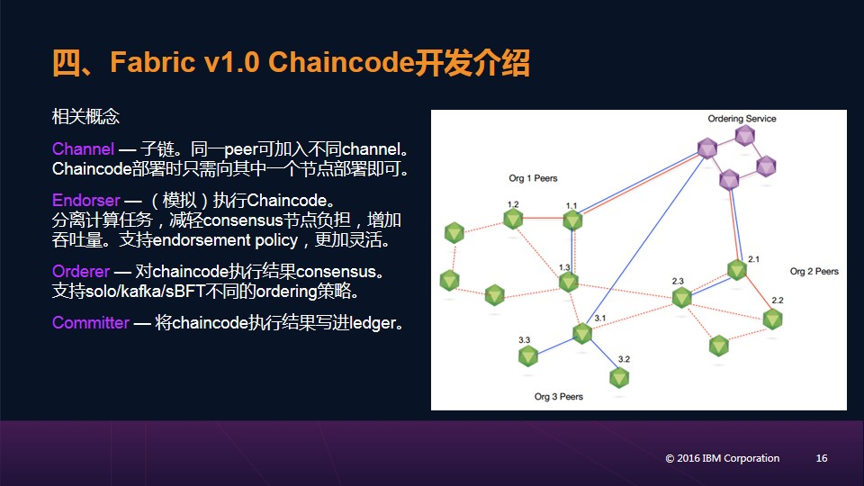

我的share到此结束，谢谢大家观看。

### 鼓励支持

