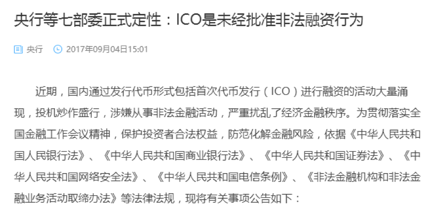
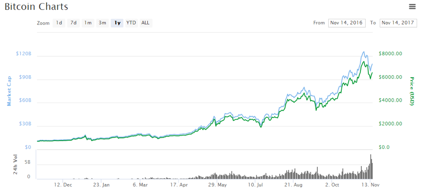
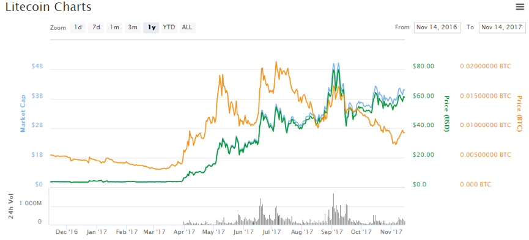
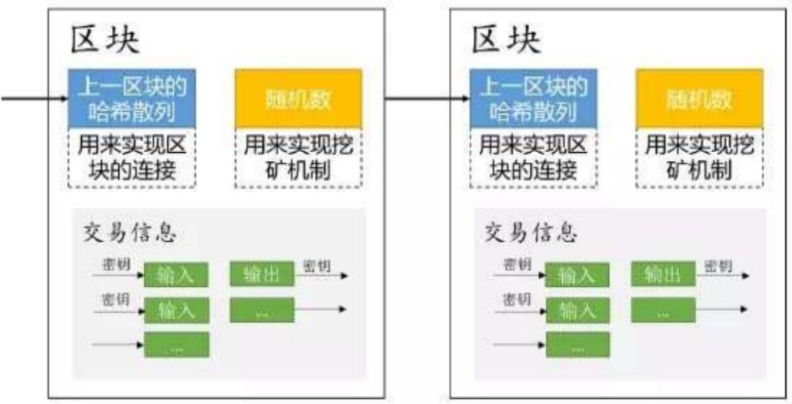
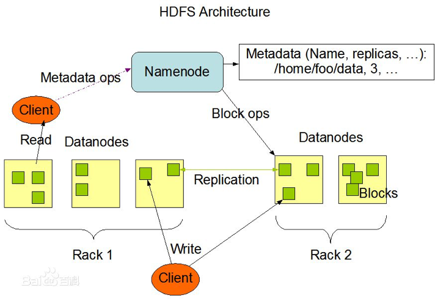
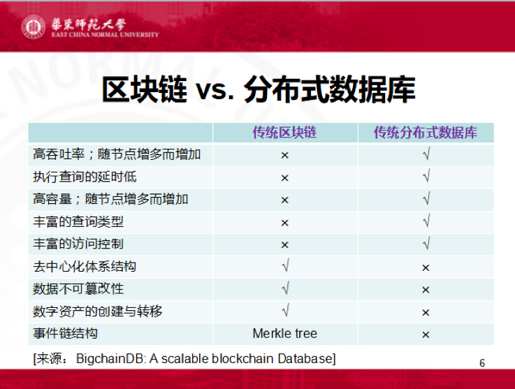
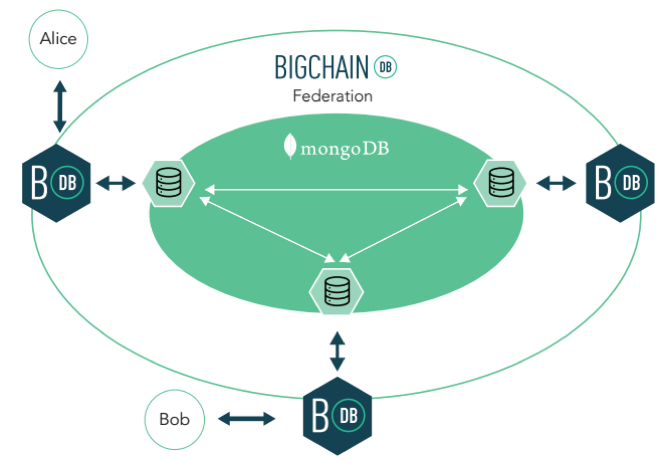
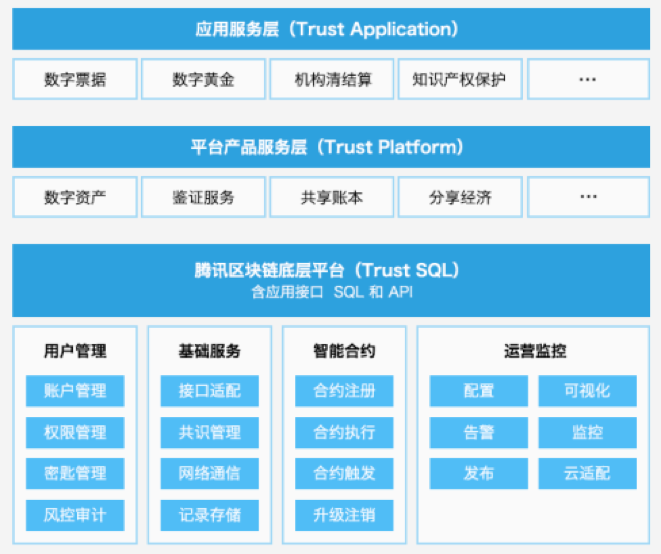
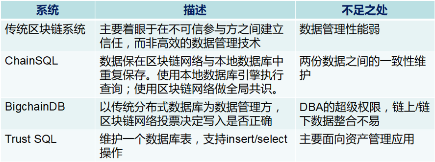
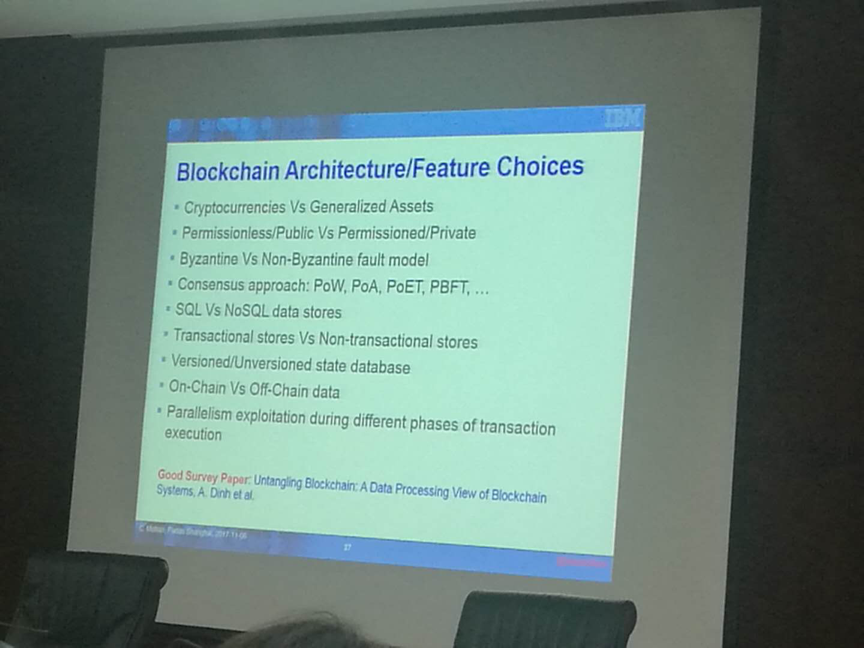

# 从数据库角度看区块链

区块链高级技术专家群内部讲座系列活动。

群内由区块链相关团队或组织的技术专家、学者和负责人等组成，目前仅限邀请加入。

分享内容会在 `TechFirst` 微信公众号进行首发，欢迎关注。

## 嘉宾介绍

金澈清，华东师范大学教授，博士生导师，中国计算机学会数据库专委会委员。研究兴趣主要包括数据流管理、基于位置的服务、不确定数据管理等。主持多项国家自然科学基金；已出版英文专著1部、参与翻译《海量数据分析前沿》和《Hadoop权威指南》（第2版和第3版）；发表论文80余篇，其中多篇论文获得优秀论文奖励，包括《计算机学报》优秀论文奖、上海市计算机学会普适计算与嵌入式最佳论文奖等。曾获得霍英东教育基金会青年教师奖。

## 讲座内容

各位朋友，大家好。先自我介绍一下，我叫金澈清，华东师范大学教授，博士生导师，主要从事数据库领域的研究工作。很高兴能够有机会与大家一起交流在区块链方面的一些个人体会。区块链在最近两年非常红火，它就像一个wifi，谁都想来蹭一下。也有人将区块链视作是一种分布式数据库，那我作为一直从事数据库管理方面的研究人员，也非常好奇能否从数据库的角度来进行解读，最好也能够找几个学术会议和期刊来灌灌水。当然了，由于我本人一直待在高校里面，没有工业界的从业经历，所有部分观点可能不够全面，会有所偏颇。不当之处，请大家海涵，多多批评指正。【演讲稿后续会整理推出。如果大家要转载的话，请注明出处。谢谢大家。】

区块链的火热，并非始于今年，但是今年尤其热闹。上半年ICO（初始代币发行）喧嚣一时，顶峰时期，市面上曾经出现500多个以区块链概念为核心的ICO项目。传闻有些ICO项目的投资回报率甚至高达五六十倍。相信群里一些入行较早的朋友也已经尝到了甜头。但是，ICO项目良莠不齐，虽然也存在一些很成功的案例，但是还有些项目仅仅拥有粗糙的白皮书；甚至连白皮书都没有，只有一张屏幕截图，其目的只是圈钱而已。今年9月4日，央行联合7部委发布公告，叫停ICO，各类代币发行融资活动应当立即停止。已完成代币发行融资的组织和个人应当做出清退等安排，合理保护投资者权益，妥善处置风险。

虚拟货币是今年的又一热点。“突飞猛进”四个字似乎也还无法完全能够形容虚拟货币市值的特性，其走势同时也呈现剧烈的涨跌震荡之势。一年以前，比特币价格是705美元，而今天的价格则到了6574美元，最高曾经摸到7535美元，几乎是一年涨了10倍！莱特币则是涨势更为凶猛的虚拟货币。一年前的价格是3.9美元，而今天则已经站上了61美元的高位！但是这些虚拟货币脱离了央行的监管范围，为了防止过度炒作，监管部门又禁止了比特币等电子代币在国内市场的交易，中国监管当局要求境内比特币交易所制定无风险清退方案，9月底前关停。下面两图是比特币和莱特币的一年行情图（https://coinmarketcap.com/）。

值得一提的是，在一片喧嚣之中，区块链技术本身并没有被监管层所否定。央行的数字货币研究所正在积极研究基于区块链的数字货币。国务院“十三五规划”指出：“信息技术创新代际周期大幅缩短，创新活力、集聚效应和应用潜能裂变式释放，更快速度、更广范围、更深程度地引发新一轮科技革命和产业变革。物联网、云计算、大数据、人工智能、机器深度学习、区块链、生物基因工程等新技术驱动网络空间从人人互联向万物互联演进，数字化、网络化、智能化服务将无处不在”。李克强总理向2017中国国际大数据产业博览会致贺信中提到：“当前新一轮科技革命和产业变革席卷全球，大数据、云计算、物联网、人工智能、区块链等新技术不断涌现，数字经济正深刻地改变着人类”。

区块链技术本身并非单一技术，而是充分融合了多项技术，包括信息安全、密码学、分布式系统、数据库等。作为一名数据库行业的从业者，自然而然地会去思考：区块链的繁荣到底有多少成分是归结到数据库的成功，抑或是数据库人的成功？在很多场合下，区块链技术通常被认为是一种分布式数据库。因为它将所有账本存储在分布式系统之中，并且为所有账本构建区块链，以支持账本的不可篡改性。区块本身也是一种新颖的数据结构，利用Merkle-tree来验证数据是否被修改。区块链上的信息对于所有用户均是透明可信的。由于账本保存在多个节点之中，少数几个节点宕机并不影响整个区块链网络的可靠性。总而言之，区块链同时具有分布式对等、数据库链式、防伪造和防篡改、透明可信、高可靠性等优点。下图显示了区块链的基本结构。

值得注意的是，传统的分布式数据库并非只有上述特性，而是具有更多特性，比如高吞吐率、低延时、高容量、查询多样性、权限控制等。

所谓的高吞吐率，是指分布式数据库每秒钟能够处理的事务数量（TPS）比较高。大型分布式数据库系统能够每秒钟处理上万笔交易记录，甚至更多。刚刚过去的双11，支付宝的支付峰值达到25.6万笔/秒，是去年的2.1倍。相比而言，在区块链系统上的TPS往往比较低。比如说比特币，每秒钟只能够完成7笔左右。比特币是公有链，需要达成全网共识，当节点众多时，受网络传输速度影响，其tps值无法更高。对于联盟链或者私有链来说，其节点数量要远远少于公有链，在一些极特殊情况下（比如说所有节点处于一个高速相连的网络之中），TPS能够达到较高值。但是总体来说，区块链系统的TPS值要远低于传统的分布式数据库系统。

其次，低延时。传统的分布式数据库能够在较短的时间之内执行查询，并且迅速返回查询结果。当执行完毕时，相关操作结果就正确确定了。但是在区块链系统中，延时要高得多。区块链系统会将所要处理的事务累积起来，达到一定程度之后才整体进行提交。例如，在比特币网络之中，产生一个区块平均耗时10分钟。更有甚者，比特币所采用的POW方式并不能够保证一个区块产生之后就能够立即生效，还取决于当前所产生的区块是否位于最长的链条之上。这又增加了查询结果的延时。

再次，高容量。传统的分布式数据库系统构建于分布式集群之上。当配置了更多计算节点、使用了更多存储资源时，整个数据库系统存储能力线性增加。打个比方，假设每个节点的存储能力是1PB，那么如果有30个节点，则总的数据存储容量可以是30PB。即使采用三复本策略增加数据冗余度，仍然还具有10PB的存储容量。但是在传统的区块链网络之中，并非如此，数据往往是全量存储在分布式节点之中。当节点数量增加时，只是表明数据在更多的节点之间被重复保存，并不会增加可存储的数据总量。比如说，在30个节点的条件之下，其总体数据存储规模仍然是1PB。

上图是HDFS的架构，来源于百度百科。熟悉Hadoop的朋友会很清楚，namenode是存放元数据的，而诸多datanode都是存放真实文件数据的。当datanode越来越多、且复本数量不变时，整个HDFS的数据存储容量也在线性增加。

第四，查询的多样性。熟悉数据库原理的朋友都知道关系数据库有六大基本代数操作，包括选择（select）、投影（project）、重命名（rename）、笛卡尔积（Cartesian product）、集合差（set difference）、集合并（union）等。并基于这六大基本代数操作来构建出复杂的关系代数表达式，能够支持非常丰富的查询。但是在区块链系统之中，目前能够支持的查询种类还并不丰富。存储区块链的系统除了文件系统之外，被广泛使用的还包括键值对数据库（例如levelDB）。键值对数据库模式简单，主要的操作方式是根据给定的键提取出相关的值，这也制约其无法执行更加丰富的查询操作。

第五，权限控制。传统的分布式数据库中具有严密的访问控制机制。可以为不同用户设置对不同对象（包括数据库、关系表）的访问控制，例如select、update、delete等。还可以设置用户组，支持多个用户共享一个用户组。权限可以很方便地授予其他人，也可以从用户手中收回。但是在区块链系统中，关于数据访问权限的讨论比较少，原则上所有用户对于数据的权限是一致的。下面，看一张图，描述了区块链系统和传统的分布式数据库系统的比较，来源于BigchainDB的白皮书。

在这张图中，作者从九大特性比较了传统区块链技术与传统的分布式数据库系统之间的差异性。虽然区块链系统也被称为是“分布式数据库”，但是二者的差异性非常大。前五大特性是传统分布式数据库有的，而传统区块链数据库所没有的；后四大特性是传统的区块链系统所拥有的，而传统的分布式数据库却缺乏的。从这个角度来看，至少也很难得出结论说区块链系统是受到分布式数据库的启发而产生的。事实上，尽管中本聪其人是谁目前还不知道，但是一般来说，比特币被认为是一些安全专家弄出来的。

现有的区块链技术是否已经能够足够好地解决数据管理问题了呢？小平同志曾经说过：不管黑猫白猫，抓住老鼠就是好猫。在此，我们先回顾一下区块链技术应用的主要场景。大体上来说，区块链技术可以分为公有链、联盟链和私有链。公有链的代表是电子代币，面向广大用户。联盟链是面向某一个特定行业，该行业内部的若干个机构一起参与，并建立互信关系。私有链是某个机构内部的所构建的区块链。

试举一个应用案例来说。仓单在钢铁行业中非常重要。钢铁制造商购入原材料、生产产品、销售产品。产品的生产和销售时间有一定的间隔。在产品销售之前，资产就会积压在仓库中，从而影响到后续生产。仓单是关于产品的凭证，证明这个产品确实存在。生产企业可以凭借仓单到金融机构去融资。所以，仓单的可信度非常重要，所有参与方都需要相信该仓单，包括生产厂商、仓库、交易平台、参检单位、运输公司、金融机构等。但是众所周知的是，这些参与方之间并不互相隶属，具有不同的利益诉求。在传统的方式之下，就是做一个仓单公式平台，这个平台是由某一方进行维护的，其他各方均无条件地信任该平台。但是，其他参与方并无法从技术上保证仓单的可信性。

区块链的出现，为仓单流转提供了一个新型的交易模式。如果存在一个以区块链为核心的仓单交易平台，所有的仓单记录都存放在区块链之中。所有参与方都能够看得到这些交易日志，而且这些交易记录都不可篡改的话，那么就能够比较好地解决这个需求。

通用的区块链技术就能够解决这个问题，不论是以太坊还是超级账本。我们课题组也建立了一个关于仓单的原型系统。这个仓单系统的构建体系架构是比较主流的。利用Hyperledge Fabric构建出一个区块链网络。所有的节点部署在云上。同时，在本地构建Mysql数据库，来保存一些本地数据信息。但是，这种架构在实施过程之中，也存在一些不足之处，就是说超级账本和本地的数据库分别隶属于不同的数据库系统，无法基于两套系统进行统一操作。Hyperledge Fabric本身对于查询处理的能力也有待提升，无法支持更复杂的查询。

近年来，将区块链技术与现有数据库之间进行融合的努力也一直都在进行之中。很多人意识到了现有区块链系统的不足之处之后，想将区块链技术与数据库技术融合起来，从而更好地管理数据。代表性的产品包括众享比特的ChainSQL（在2017年1月发布了1.0版本的白皮书）、德国的BigchainDB（在2016年2月份发布了白皮书，这个白皮书也在不断更新之中）、和腾讯的Trust SQL（在2017年4月份发布了白皮书）。以下简要地介绍一下这几款产品。

首先是ChainSQL。ChainSQL在国内起步比较早。以下是该产品的架构图，来源于ChainSQL的白皮书。

先介绍一下这几个符号的含义：

* NC: 连接数据库的区块链节点；
* DB: 传统数据库；
* C: 客户端节点；
* N: 区块链节点；
* DB: 商业数据库。

在这个架构中，处于核心地位的是由若干个区块链节点（N）构成的区块链网络，这些节点之间互相通讯，从而达成共识。但是由于在区块链网络之中查询性能不高，因此就外接商用数据库，可以将区块链上的数据库导入到商用数据库之中，由商用数据库执行查询。这样的架构尝试同时利用区块链网络和商用数据库的优势，提升了查询性能。白皮书同时还提到数据之间的一致性验证问题，就是如何将区块链数据和商用数据之间保持一致性的问题。

下图是 BigchainDB 的架构图，来源于其白皮书。

从该架构图可以看出，BigchainDB的架构与ChainSQL并不相同。处于核心位置的是现有的分布式数据库系统。早期使用RethinkDB，现在推荐使用mongoDB。这些数据库系统提供了丰富的数据库访问功能。为了保证数据的可靠性，这些分布式数据库还可以使用多副本策略，将数据分散存放在不同节点中，保证数据的可靠性。外层是区块链层，通过投票机制来决定数据是否可以合法地入库。为了保证系统整体的公平可信性，该架构尝试将处于中心位置的数据库的管理员的权限降低，甚至低于其他参与方的权限。然后其他参与方的行为就具有可信性了。

从发布的白皮书来看，ChainSQL和BigchainDB都宣称具有良好的数据库访问效果。二者的良好效果主要就来自于外接的数据库管理系统。ChainSQL能够提供类似先入库，再验证的机制。当事务数量比较多的时候，可以先写入到数据库之中，再等待验证，如果验证通过了，则结束。否则的话，再回退前面的这些处理过程。这种机制能够在事务量比较多的时段加快事务处理速度。BigchainDB由于是以分布式数据库为核心，逻辑上可以视为各个节点在“监视”分布式数据库的状态，因此其吞吐率也比较高。

腾讯的Trust SQL系统是最新出来的区块链数据库系统，其架构图如下所示，来源是该系统的白皮书。

Trust SQL提供了一个中间接口层，为腾讯的上层业务服务，包括平台产品服务和应用服务等。Trust SQL本身包含了用户管理、基础服务、智能合约、运营监控等功能。这个架构的主要特色是提供了类SQL的语言进行操作，支持insert和select操作，比较方便。在当前阶段，Trust SQL尚未提供更加灵活的数据库表结构，仅仅提供了一张表结构（t_transaction）来记录所有日志。

下表对以上三种区块链数据库和传统的区块链系统进行比对。

虽然目前的区块链数据库虽然各有进展，但是仍然各有不足之处。传统的区块链系统并不具备良好的数据管理功能。传统的区块链的首要目的并非支持复杂的数据管理，而是要在不互信的各方之间建立信任关系。所采用的数据管理软件也主要是键值对数据库等比较简单的数据库产品。

ChainSQL方案意识到了传统区块链系统的不足，提出利用商用数据库来进行管理。商用数据库具有强大、成熟的数据管理能力，使用商用数据库能够简化查询处理。但是如何在两份数据之间维护数据一致性，也是一个有待考量的问题。换句话说，当数据进入商业数据库之后，数据管理者就假定认为数据是正确的，从而在上面执行很多查询。此时如果有人修改了数据库中的记录（假设公司内部有内鬼），则数据库管理员无法在第一时间得知这个信息。反之若每次执行查询前都验证二者数据库之间的一致性，性能也会受到极大影响。

对于BigchainDB来说，核心层是现有分布式数据库。从其发布的白皮书来看，能够支持的tps非常高，远远高于传统的区块链系统。这主要是分布式数据库本身的功能。特别的，因为分布式数据库的多副本制度中，副本数量往往是固定的。这使得硬件设备逐步增加时，系统的存储容量也是同步线性增加的。这一点有别于传统的区块链系统。但是，BigchainDB的一个不足之处是分布式数据库的选型和参数设置。传统的分布式数据库系统必然有一个系统管理员的角色，能够在系统之中做所有事情。这在区块链系统之中就会成为一个bug——毕竟谁都想成为管理员。在其白皮书中曾经提到可以通过降低数据库管理员权限来使这一点不至于成为影响去中心化目标的障碍。对于这一点是否能够完美地实现，我存有疑虑。

腾讯的Trust SQL目前给出的信息还不太多，也没有性能评测报告流出来，无法评价其优劣。但从已经发布的白皮书来看，有优点也有缺点。优点是有类SQL语句，能够提供良好的数据操作接口。缺点是数据库表结构的定义还比较单一，还不知道是否能够提供更加复杂的查询功能。

区块链系统发展到现在，在很多应用中广泛应用。当应用进一步发展时，为现有区块链系统增加数据管理能力，就成为一种趋势。从目前的发展情况来看，以下几点会成为未来需要考虑的方向。首先，是sharding技术，也就是数据分块。将全量数据存储在整个区块链网络的所有节点之中，显得并不高效。如何将数据进行划分，并且放到不同的节点之中，就显得非常重要。其次，使用的方便性。类SQL语言能够使得用户操作更加便捷。再次，是模式定义的丰富性。是否可以在区块链中定义多种数据类型。

关于数据分块技术，在CCS 2016会议上有一篇论文“A Secure Sharding Protocol For Open Blockchains”，提到了一种方法。大体的意思是说：假设不诚实节点的数量比较少，低于某一个阈值的话，可以通过随机采样的方法，构造出来一个小集合，只要在这些小集合之间达成共识，就可以了。由于是随机采样的关系，那么尽管是一个小的样本集合，在这个样本集合之中仍然能够以比较高的置信度来确保不诚实节点的数量低于某一个阈值。这是可以从理论上证明的。当然，随机算法本身也确实有一定的失败率。相关的研究工作仍然有待深入。

最后，附上一张图，是IBM的区块链专家C. Mohan上周刚刚在复旦大学做学术报告时的一个截图。区块链系统本身有很多属性，从共识算法、查询语言、事务处理、状态数据的管理、共识机制等具有差异性。很难有一种通用的技术能够涵盖所有的应用场景。那么，我们就跟随图灵奖得主 Stonebrake 的名言：“one size does not fit all”。

谢谢大家。

## 答疑解惑

**问：大数据区块链等新概念的出现是否意味着数据库技术的发展现在碰到了瓶颈？**

答：我觉得区块链技术是从另外一个方面补充了传统数据库。正如stonebrake所说，one size does not fit all。在一些新的应用场景之下，特别是在许多参与方没有建立信任关系的前提之下，目前很多数据库管理技术（基于集中式架构）确实无法使用。区块链恰巧能够适应这样的应用场景。将区块链技术与数据库技术相融合，能够解决更多的领域问题。

**问：数据库领域的相关背景给研究区块链技术带来哪些优势？**

答：我觉得有很强的促进意义。因为区块链技术从发展到现在为止，真正在数据管理方面的着眼点还不太多。我们通常说的数据管理，往往是指查询语言，存储与索引，数据库模式，数据库范式，事务管理等概念。但是从目前来看，很多区块链技术并没有达到这个要求。将现有的数据库技术融入到区块链系统中去，我认为至少在便捷性和高效性方面会有很大意义。

**问：加密盲抽选取共识节点和刚才金老师说的可信随机集合工程实现有哪些突破？**

答：我不是特别理解“加密盲抽选取共识节点”所指。不知道是否就是我前面提到的那个。我前面所说的就是随机采样。一个通俗的解释就是说：假设一个袋子中有1000个球，其中有100个是红球，其余是黑球。那么，任意随机取少数球（比如说取50个球），则平均下来有5个是红球。同时，从概率意义上来讲，红球的数量非常偏离均值的概率也不会太高。例如，具有超过10个红球的概率也不会太高。这是由大数定理决定的。那么，假设红球是不诚实节点，黑球是诚实节点。一般意义上可以认为即使取一个小的样本集合，也是能够保证诚实节点的数量占多数的。这样的话，就能够达到sharding的效果。

## 鼓励支持
如果你喜欢讲座分享的内容，欢迎关注微信公众号留言，对专家进行支持和鼓励。

===== 关于 TechFirst 公众号 =====

专注云计算、大数据、Fintech、人工智能、分布式相关领域的热门技术与前瞻方向。

发送关键词（如区块链、云计算、大数据、人工智能），获取热门点评与技术干货。

欢迎投稿！

