# 深度解析点融区块链云服务

金融科技高级专家群内部讲座系列活动。

由国内外金融科技相关顶尖团队的技术专家、学者和负责人等组成，目前仅限邀请加入。

分享内容会在 `TechFirst` 微信公众号进行首发，欢迎关注。

  

## 嘉宾介绍

刘辉，硕士毕业于华东理工大学。曾在爱立信担任团队负责人和产品架构师，负责流媒体移动电视、以及LTE Broadcast等系统产品的设计和研发，对高性能问题有深入的研究；后加入EMC，带领团队研发EHC混合云系统，对IaaS基础架构有较深入的理解；然后加入中泰证券担任系统架构师，为智能投顾产品建设大数据处理的中后台系统。目前在点融从事区块链云服务平台的架构设计和研发。个人也积极关注包括以太坊、Fabric、Corda等区块链技术的发展及应用项目。邮箱是: richielh@126.com，希望以后能跟大家继续保持交流。

## 讲座内容

大家好，很荣幸受邀在这里与大家深入分享一下点融区块链云服务的设计方案。

### 平台简介
首先了解一下点融区块链云服务平台的定位和特色（如下图所示）。我们目前全面支持Hyperledger Fabric区块链。另外，也支持创建一个用于测试目的的Corda区块链。
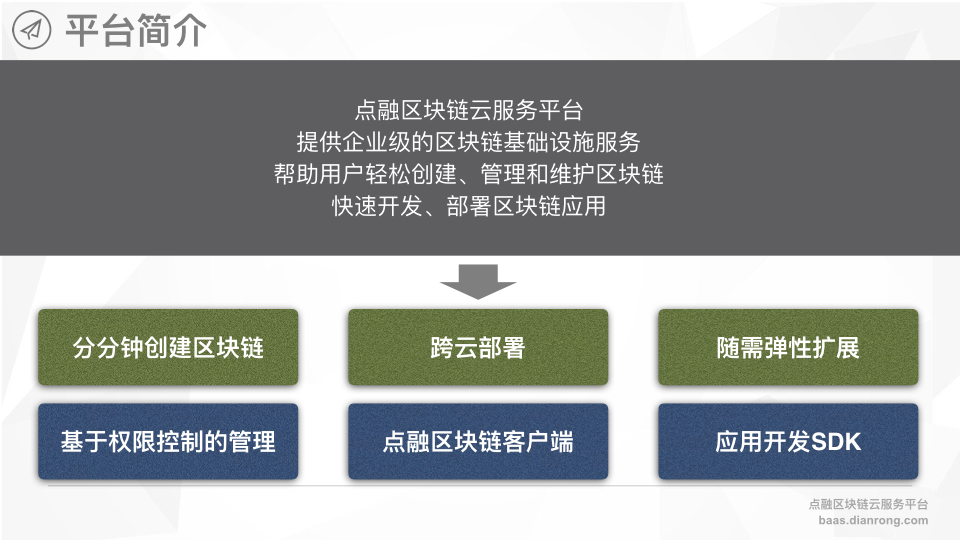

### 提纲
我会分享以下三个方面的内容。
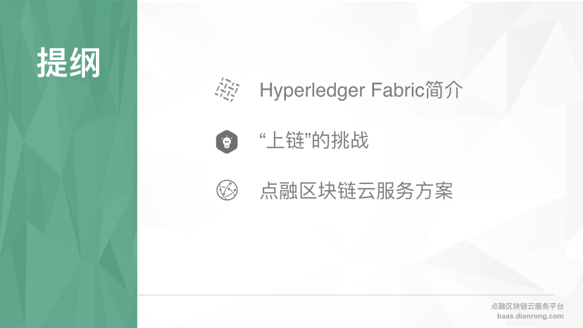

### Hyperledger Fabric简介
Fabric网络是由Orderer节点、Peer节点、以及Fabric-CA节点组成。在生产环境中，Orderer排序服务是用Kafka实现的。不同于比特币和以太网等公有链，Fabric区块链是一个授权网络，即网络中的每一个参与节点都有明确的身份。  
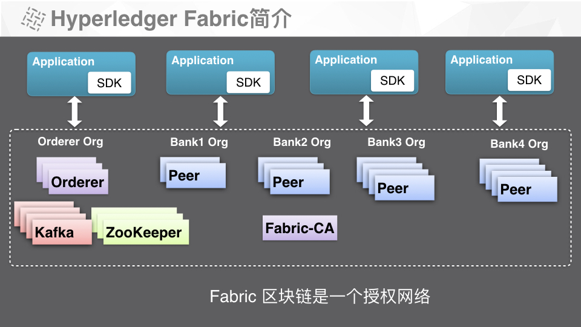

Fabric区块链本质上是一个分布式的共享账本，它通过“通道”这样的逻辑结构来实现账本的隔离。具体来说，一个Fabric区块链中有若干个联盟(consortium)和若干排序服务(Orderer)组成。每个联盟由若干组织(Organization)组成，一个组织可以属于不同的联盟。在联盟的概念下可以进一步划分成若干个通道，每个通道都有一个独立的账本，仅在加入通道的组织之间共享账本数据。每个组织都管理自己的若干个Peer节点。组织中的某些Peer节点如果安装了智能合约，并且被实例化到了某个通道上，则该节点成为该通道上的该智能合约的背书节点(Endorser)；所有的Peer节点，都是committer节点。
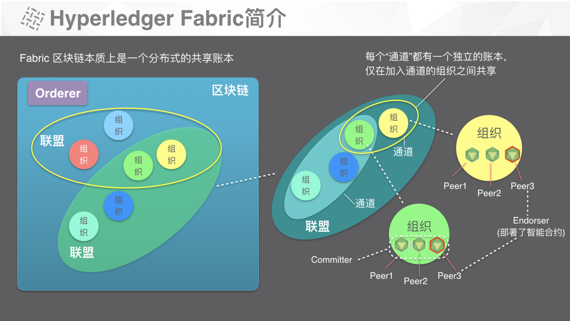

Fabric交易流程的主要步骤如下（细节略有省略）：   
1. 组织A的客户端（通过SDK）发送一个交易提案分别给组织A和组织B的背书节点。  
2. 两个背书节点验证提案的正确性、提案用户身份合法性，然后调用智能合约进行交易仿真生成读写集合，对其进行背书后将提案响应返回给客户端。  
3. 客户端验证来自于两个背书节点的提案响应的一致性。  
4. 客户端将两个背书节点的提案响应组装成一个交易，发送给Orderer服务节点。后者将一批交易打包为区块。  
5. 区块被发送给committer节点，它们对区块链中的每一个交易验证签名是否符合背书策略的要求，将交易标记为有效或者无效。  
6. 每个committer节点将区块添加到本地的区块链中，被标记为有效交易的写集合将被提交到账本的当前状态数据库。并将事件通过event hub通知给客户端。
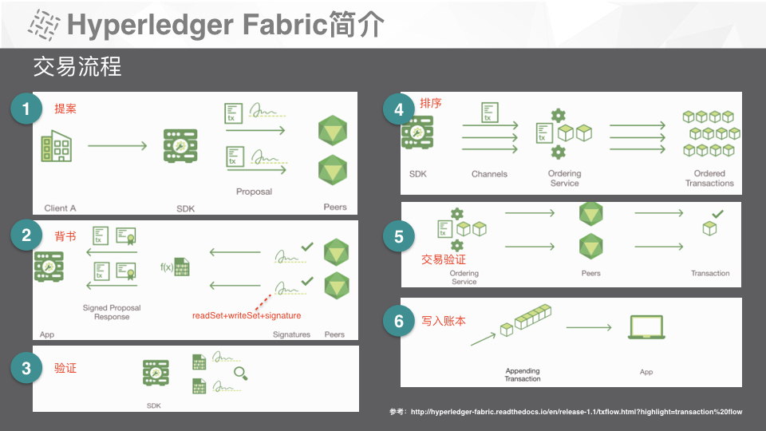

Fabric的安全机制：  
1. 基于MSP实现了强大的身份认证机制。   
2. 细粒度的访问控制策略。如：通道创建和修改策略、智能合约实例化策略、背书策略等。  
3. Fabric1.1版本还支持针对账本数据的加密存取等机制。  
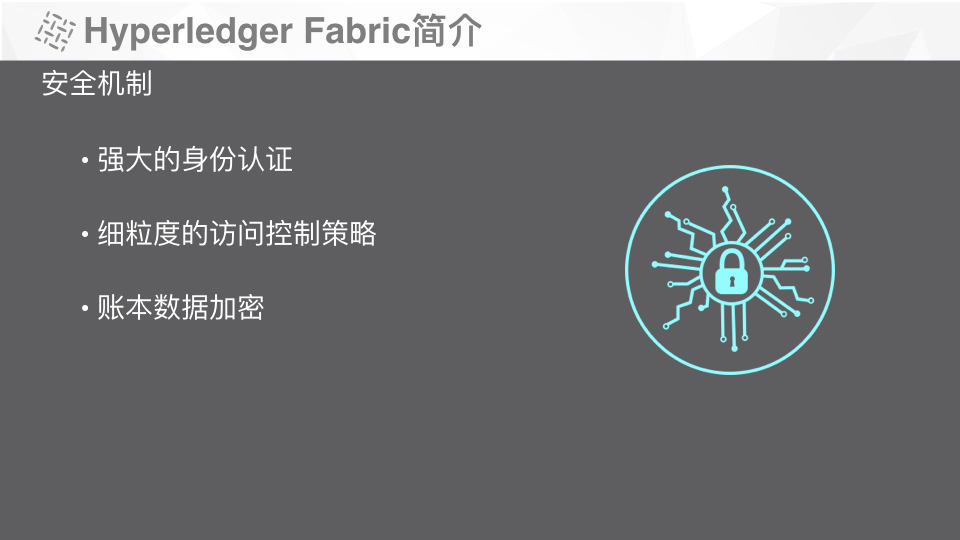

### “上链”的挑战
业务系统上链，无论是自建底层区块链还是使用现有的区块链云服务，都将面临以下几个挑战。
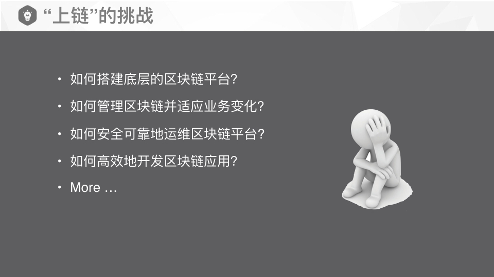

第一，搭建Fabric区块链物理网络不是很容易。其难点在于几个方面：其一，Fabric自身的网络构成还是比较复杂的。其二，由于业务需要，联盟链的参与组织可能不希望完全中心化的运维管理。一方面他们希望对自己的Peer节点有完全的管控；另一方面希望区块链节点和自己的应用系统部署在一起。这导致联盟链的节点可能分布于不同的网络环境中。因此，区块链的运维管理需要在中心化和去中心化的两极之间找到平衡点。其三，区块链物理网络应当允许动态加入新节点。
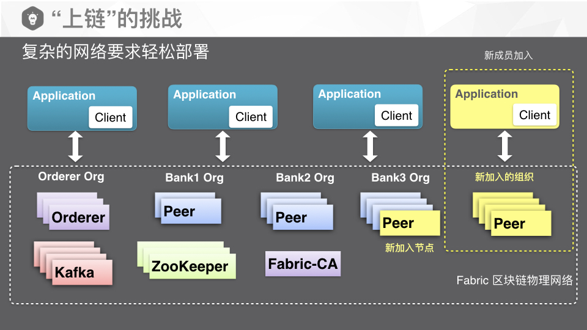

第二，Fabric区块链需要能适应业务变化。从不同层面体现出区块链应对变化的要求：其一，物理网络层要求能添加新的节点、或者对已有节点进行资源扩容以提升机器性能和存储容量，从而应对访问量的增加。其二，在Fabric区块链领域模型层面，因为业务发展，需要吸纳新的组织（即新合作方）加入已有联盟和通道以共享账本，并且升级背书策略以让新组织参与交易背书的过程。另外往通道中增加新的节点（比如：背书节点）也会提升智能合约调用的并发能力。其三，新增的业务逻辑要求发布新的智能合约，然后安装部署到通道；业务逻辑的更改，会引发对已有智能合约的升级。同样的智能合约应该也可以复用到不同的通道，但希望对合约有一个全局的管理视图。另外，合约在安装部署之前，一些重要参与方会希望能审核合约代码以确保其遵从相关业务协议，在审核完成之后对合约安装包进行签名背书。这样就可以保证每个参与方都安装的是大家一致认可的智能合约。
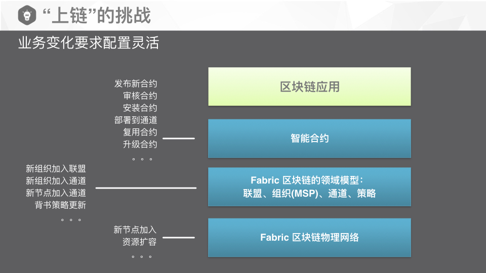

第三，对Fabric区块链的运维管理要安全可控。同样，从不同维度看有不同的要求：其一，需对物理节点的资源消耗情况进行监控。其二，需安全地管理私钥和证书；对于区块链配置的更改需要有基于权限控制的审核机制。某些配置更改需多方签名同意才能完成，此时需要有一个收集签名的机制来协调大家的共识过程。比如：允许新组织加入通道时，需大多数已有成员组织签名同意，才能对完成对通道配置的修改。问题是：谁有权来发起对通道配置的修改请求？谁来负责收集各方签名后再将请求提交给Orderer服务让配置生效？其三，Fabric的特点是，同一份智能合约可以安装在不同节点上，这些节点可以加入到不同的通道中。并且同一个智能合约可以被实例化(instantiate)到不同的通道上。此外，智能合约可以有不同版本。如果没有一个统一的视图来管理“合约--节点--通道“之间的复杂关系，那么将是一场噩梦。
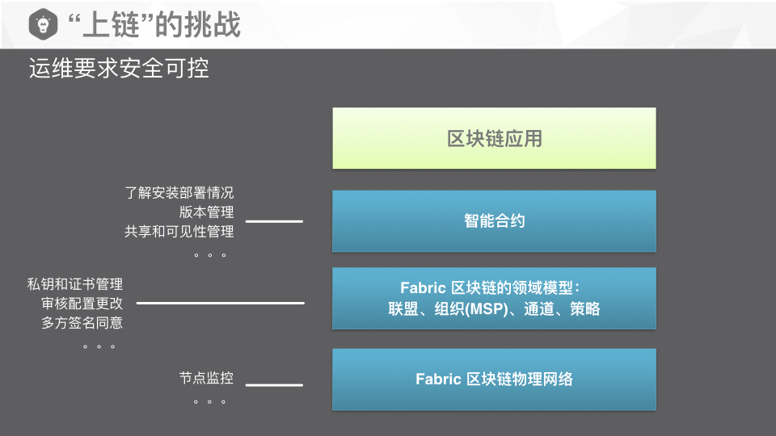

第四，区块链应用开发涉及两个方面：其一：开发智能合约；其二，开发调用智能合约的应用程序。原生的Fabric SDK功能非常丰富，提供的API比较基础，但直接用来开发应用程序会有些不便。比如，调用合约时，需要应用去实现发起提案、验证提案响应以及组装并发送交易的这些交互细节。开发应用时，希望使用更简单的SDK，更希望有现成的智能合约可以复用。
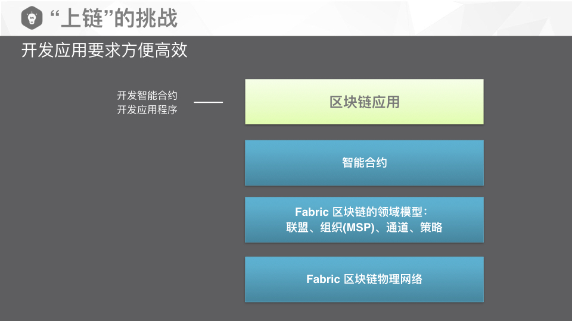

面对“上链”的诸多挑战，点融区块链云服务平台的设计初衷是：

### 点融区块链云服务方案
#### 平台整体架构
首先来看一下我们平台的整体架构，从下到上分为四个层次。底层是IaaS层，提供组成区块链的机器资源，支持公有云、外部节点、混合云。在IaaS之上是PaaS层，在这一层构建起不同类型的区块链，目前支持Hyperledger Fabric区块链以及Corda区块链的开源版本；在区块链网络之上，是区块链即服务层，点融提供一些通用场景的智能合约（如：数字积分、证据链等）、以及鼓励第三方开发者贡献智能合约，用户可以在“智能合约商店”中购买这些合约。在PaaS层之上是SaaS层，实现“应用商店”，其中包含点融为一些通用场景实现的区块链应用（如：供应链金融、证据链等）以及第三方开发者贡献的区块链应用。除此之外，还提供了对应层次的配套工具。在PaaS层，提供了点融区块链客户端用于管理私钥和证书，以及审批对区块链配置的申请；点融区块链智能合约打包工具，顾名思义，是给开发者用来打包智能合约的工具，同时也可以用来从智能合约安装包中提取出合约源码进行审核。在SaaS层提供了应用开发的SDK，让开发者更方便地开发应用。 
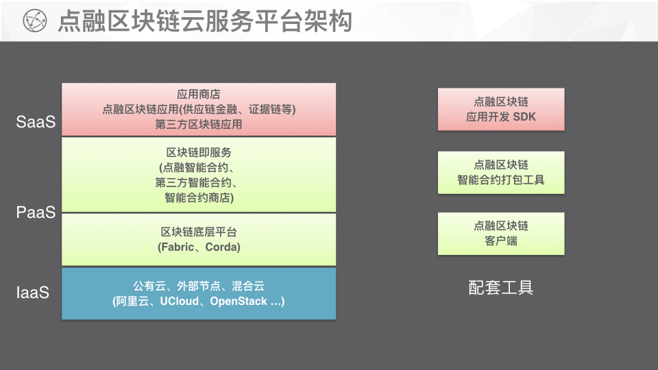

接下来将逐次展开对每个部分的介绍。

#### 更开放的联盟链
基于点融区块链云服务可以搭建出一个非常开放的联盟链。组成联盟链的节点可以来自于：   
1. 公有云，通过点融的公有云账号创出来的节点。   
2. 用户自己管理的公有云或者专有云，这种情更开放的联盟链况只需将用户的公有云账户提供给点融。这个账户被限定了权限，只能用于创建虚拟而不能干别的。  
3. 用户的数据中心，即私有网络。这种情况要求用户提供的机器对公网暴露相关端口，以确保安装部署能顺利进行，以及私有网络内的Peer节点能与区块链网络中的Orderder节点和其他Peer节点的gRPC通信能够保持通畅。  
以上第2、3类被称为外部节点。
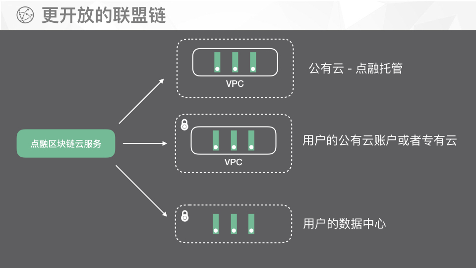

#### 资源弹性扩展
在点融区块链云服务平台上，用户可以使用虚拟机硬件配置模版创建虚拟机。也可以在区块链建成之后添加新的节点，或者对已有节点升级资源配置。
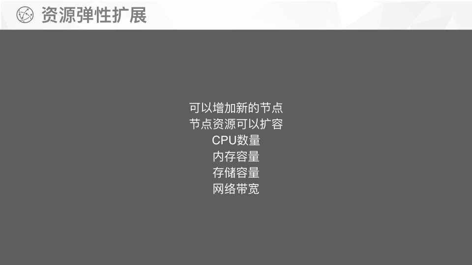

#### 区块链的搭建方式
用户在注册了云服务账号之后，可以有三种方式来搭建区块链：   
1. 创建私有链。  
2. 作为盟主，创建联盟链。盟主可以邀请其他用户（拥有自己的云服务账号）加入联盟链。  
3. 作为成员，受盟主邀请加入已有的联盟链。  
下图从全局视角展示了在我们云服务平台上私有链和联盟链的构成方式。（被红色小旗子标记的是盟主）
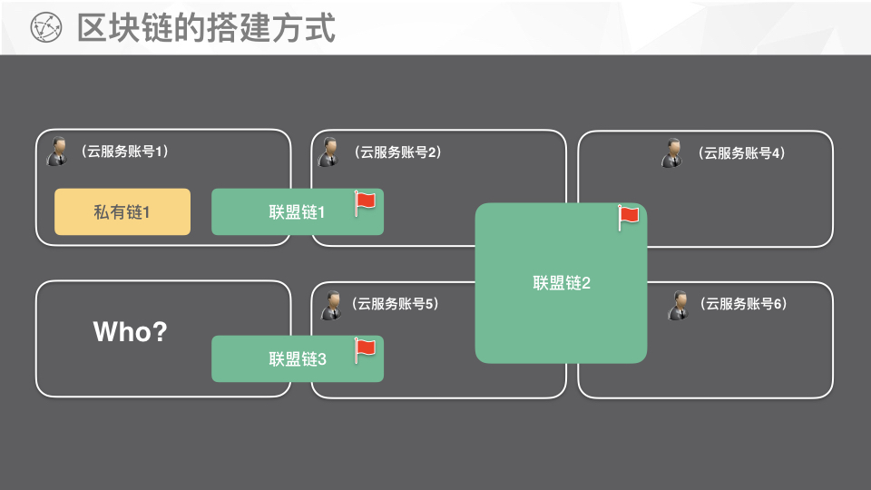

#### 私有链和联盟链
接下来，将介绍私有链和联盟链的玩法。  

私有链是由组织内部的各个机构之间组成的一个私有的区块链。这里所说的“组织”在现实中可以是一个公司或者企业。所说的“机构”是公司或企业内的某个职能部门，比如采购、财务、销售等。Orderer节点也隶属于某个Orderer组织。每个机构都有独立的CA证书，使用它来为相应的Peer节点或Orderer节点签发节点证书。下图中反应了这样的关系。
通过一个云服务账号可以创出一个私有链网络，该账号即为这条区块链的管理员，他统一管理链上的所有节点，并进行配置管理。

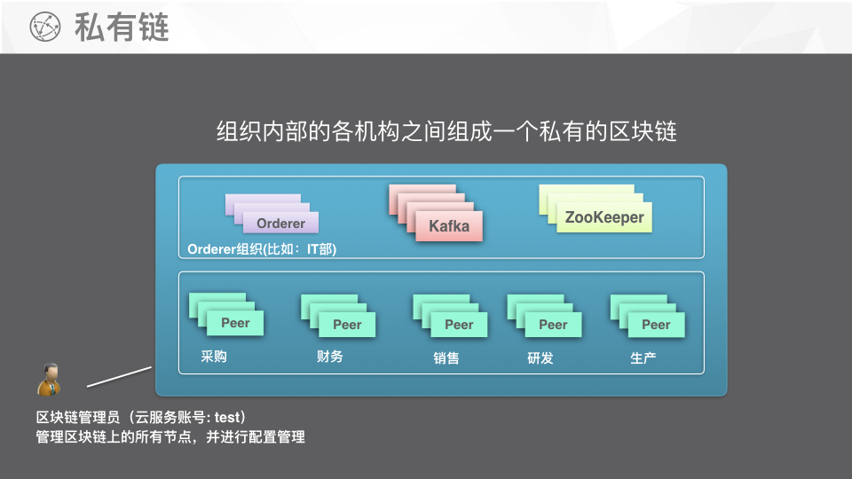

联盟链是由不同组织共同组建的一个可以在成员之间共享账本的区块链。这里所说的“组织”在现实中对应为一个公司或者企业。举两个例子：一个行业协会中的不同公司为了共同的商业利益组成联盟链；或者是在一个供应链中的上游企业与其下游供应商以及资金提供方一同组建一条联盟链。在我们平台上，定义了“盟主”和“成员”两个角色，他们都拥有独立的云服务账号。盟主是联盟链的发起者，通常由受各成员共同信任的组织担当，他管理共识节点，并发起对区块链相关配置的创建和更改。成员是联盟链的参与者，他管理自己组织的Peer节点，并参与对区块链配置管理的共识过程。联盟链还支持动态加入新的成员组织，只需盟主发布邀请，并征求已有组织同意之后将其加入相关通道即可。
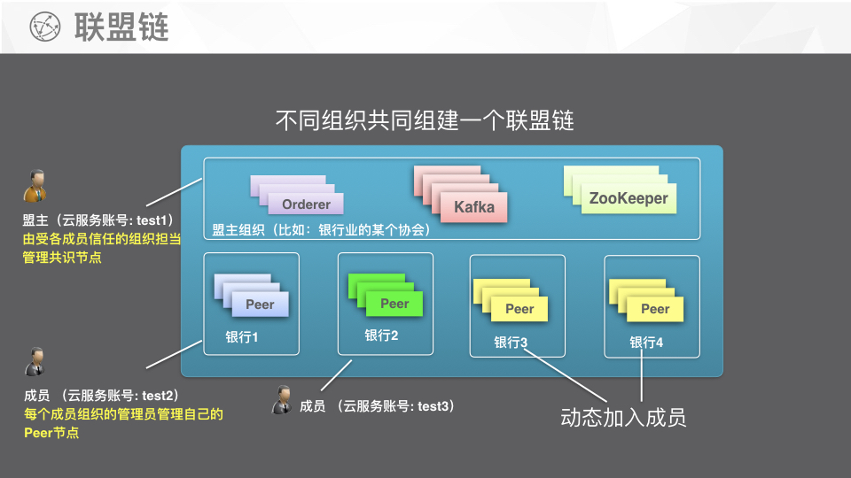

#### 基于权限控制的区块链管理
区块链管理涉及三个方面：联盟管理、通道管理和智能合约管理。我们设计了一套安全的基于权限控制的区块链管理方式，即：用户在云平台上发起管理请求，然后通过”点融区块链客户端“对请求进行审批。下图中展示了这样的操作方式，并给出了一个客户端审批内容的示意图。点融区块链云服务平台不保存任何的用户私钥。因此，我们设计了客户端来管理用户的私钥和证书，它可以安装在用户本地的windows或者mac系统上。另外，我们让客户端承担了对于配置管理的审批功能（对gRPC消息进行签名）。因为配置管理属于低频次的操作，所以为了更高的安全性，在不使用时可以不启动客户端。

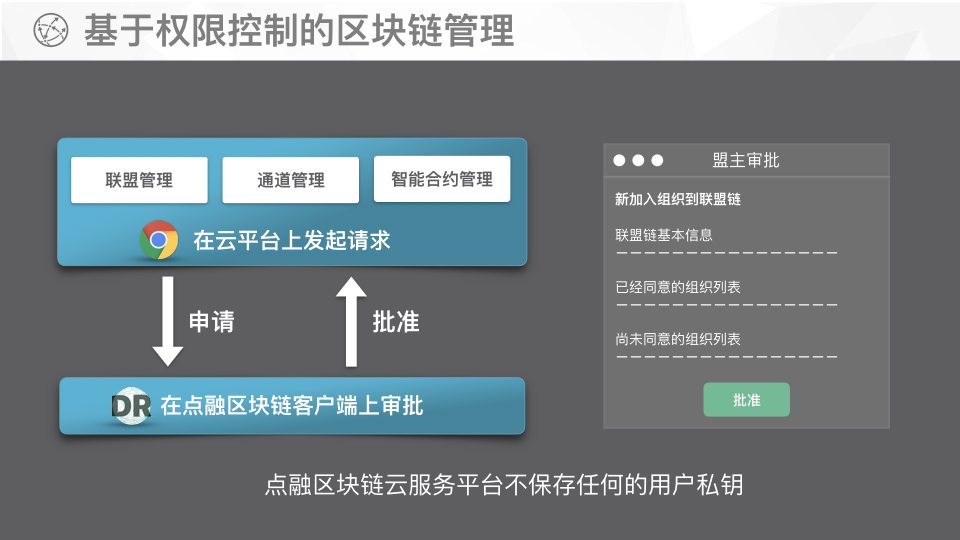

让我们更加深入了解一下客户端的原理。它是基于Electron和React开发的web app，具有良好的跨平台性。客户端中有一个Crypto Service模块负责管理私钥和证书、以及签名等功能，私钥和证书被保存在一个本地的加密文件中。客户端通过登录点融区块链云服务后端获取审批请求，在签名同意之后将信息提交到云服务后端，后者与Fabric区块链网络节点进行gRPC调用以完成相关配置操作。在某些审批场景中，云服务后端将承担收集各成员组织签名（通过各自客户端）的职责，直到满足相关签名策略要求之后才提交给Fabric区块链网络节点以完成配置。 
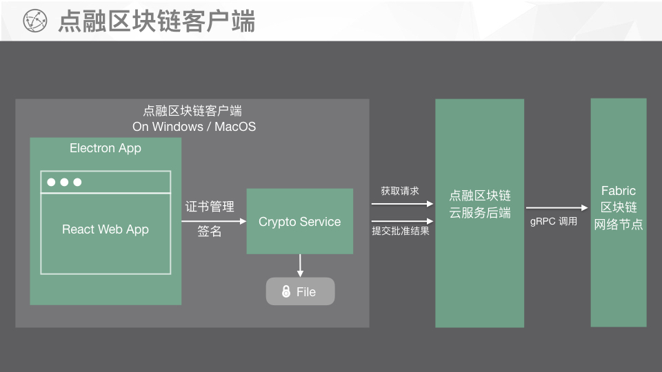

以下给出了一个数字积分的联盟链中，一个零售公司作为新成员加入通道的共识过程。假定原有通道中已经存在了三个公司分别是：航空公司、移动运营商、银行。并且通道修改的策略为要求半数以上已有组织的签名，修改才能被区块链接受。当盟主发起邀请零售公司加入通道的请求(ChannelConfigUpdate)之后，三家公司的客户端都可以收到该请求，对其签名。当盟主收集到足够签名之后，方可提交给Orderer节点让修改通道生效。 
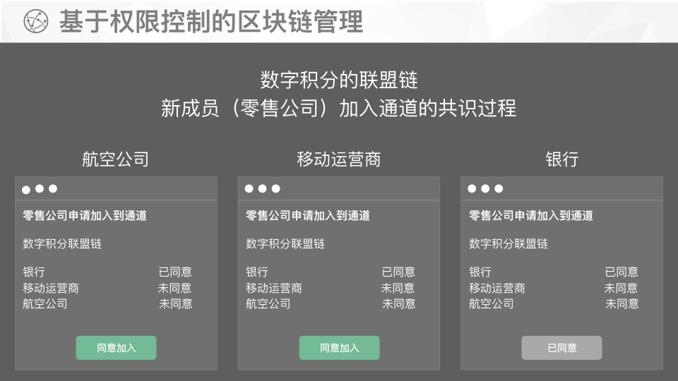

点融区块链云服务实现了智能合约的完整生命周期管理。当开发完智能合约之后，开发人员可以通过我们提供的智能合约打包工具将源代码打包，然后由管理员通过点融区块链客户端将智能合约安全地上传到云服务平台。管理员可以将同一份智能合约发布到不同的区块链上，使得合约得以复用。发布合约时需要在客户端进行审批，当审批通过后，在智能合约的SCDS中将包含该用户的背书表示对合约代码的认可。合约发布到区块链上之后，链中的所有成员组织的管理员各自将它安装到自己的Peer节点上。接着，合约的发布者在线发起实例化请求，通过可视化的页面选择将合约部署到哪个通道，并指定初始化参数和背书策略，然后经由客户端审批将合约部署到通道中。最后，平台还支持对智能合约的在线升级。
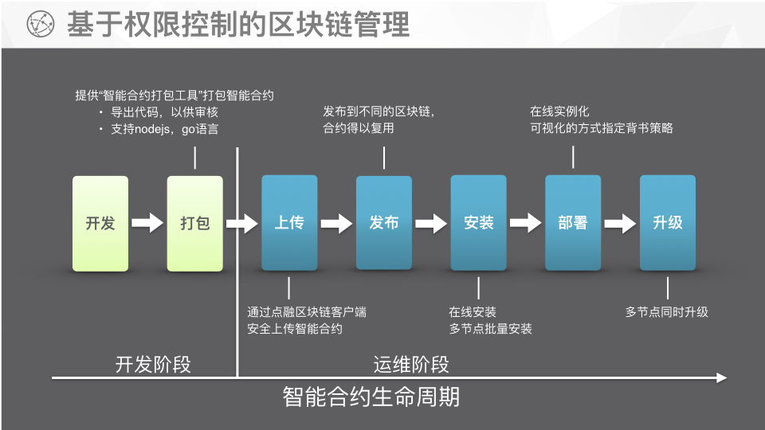

下面的表格总结了目前支持的各项区块链配置操作、及其对应的发起人、审批人、以及是否需要收集多方签名。后续，我们将支持对策略本身的配置管理。 
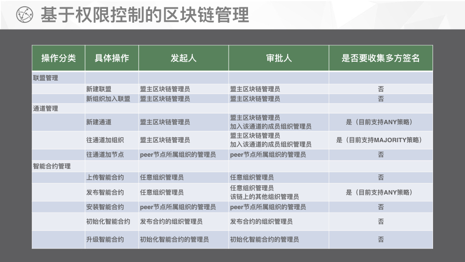

#### 区块链应用开发SDK
为简化区块链应用开发，我们实现了一套应用开发SDK。该SDK在原有的fabric-java-sdk的基础上实现了一些辅助服务，以使开发变得更为简单。这些辅助服务包括：  
1. 通道管理服务。用户可以从云服务平台导出一个包含区块链配置信息的yaml文件，其中包括所有组织、Orderer节点、Peer节点、通道、以及部属的智能合约等信息。通道管理服务会解析该yaml文件，应用程序可以非常方便地建立起对区块链上通道的"连接"，通过该“连接”调用通道上的智能合约。    
2. 区块链用户管理服务。应用程序需要以通道内某个组织的用户身份，访问部署在通道上的智能合约。原生Fabric SDK要求实现User接口以获取用户私钥和证书文件。点融区块链客户端管理着该组织在该区块链上的用户私钥和证书，并可以将它们导出。区块链用户管理服务会读取到这些信息，为应用程序提供User实例。  
3. 实现了调用和查询智能合约的帮助类：ChaincodeInvoker 和 ChaincodeQuerier，屏蔽了与交易流程相关的细节。  
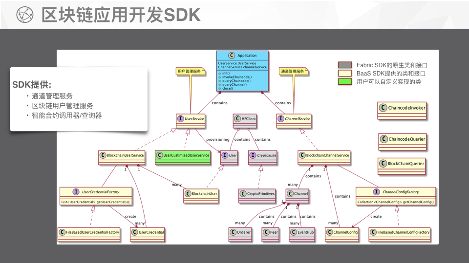

下面展示了使用点融区块链应用开发SDK来调用智能合约的示例代码。 
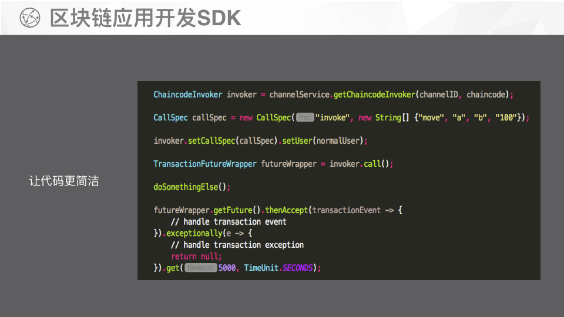

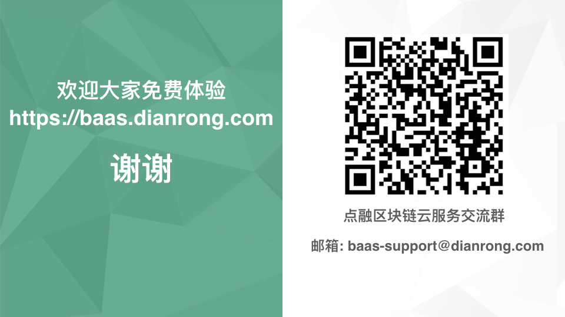

## 答疑解惑

**问：请问这个实现保留了gas控制概念吗？如何定义和估量gas消耗，以及进行控制？**

答：Burrow的EVM实现中保留了gas，但是作用仅限于保护其不会被恶意合约代码进行DoS攻击，并没有以太坊中多个tx竞标的作用。Sawtooth在移植的时候，默认每个tx是9000，但是可以进行配置。我们暂时也打算这么做。如果大家有更好的建议可以提出来。

**问：导入外部节点和组织如何实现？特别是证书。**

答：我们支持外部节点时，也是通过点融区块链客户端来给这些节点生成证书，并部署到这些外部节点上，并在这些节点上部署Fabric区块链程序以及相关配置信息。

另外，我们的客户端可以支持导入外部的CA证书，并使用它来签发Farbic组织内的相关证书。

**问：智能合约上传后有哪些检查？**

答：合约打包后通过点融区块链客户端进行上传到云服务平台，此时的检查主要包括，检查合约压缩包的hash是否一致，以及合约版本、名称、路径等信息是否准确。

**问：平台中是否有计费系统？如何处理的？**

答：目前是免费赠送一笔费用可以让用户创出一条区块链，大约使用两周。
计费是按资源费用+服务费用，以及使用时常来决定。
现在我们正在开发新的计费模式，为了鼓励和孵化种子项目，采用不同的服务包。

**问：资源计费这块不同用户使用的网络流量是如何统计的？**

答：用户在我们这边买的固定带宽，比如10M，不限流量的。用户买的时候有一个计费周期，比如按周、月、年等。

**问：您认为目前客户对于baas的需求是否强烈，会不会说因为高门槛，客户更愿意得到整套的解决方案和部署服务，不会直接使用baas云服务自己上手做开发。**

答：我觉得客户对BaaS的需求还是蛮强烈的，BaaS能为客户解决底层平台搭建的问题，让用户专注于业务，目前的确是降低了使用门槛。但BaaS本身也在往SaaS上演进，平台本身会提供更多可以直接拿来用的智能合约，以及应用方案。我们在跟客户沟通时，也收到这样的强烈诉求，希望能降低开发门槛。

**问：目前点融baas还支持corda，为什么选择corda没有选择其他底层环境，后面还会支持哪些底层？谢谢！**

答：Corda是专注于金融行业的方案，点融自身是一个金融公司，所以我们也想尝试一下corda，先进行技术积累和摸索。同时也提供出来让大家免费体验，一起摸索。目前我们支持的是corda开源版本，功能有限。
目前还没有支持其他底层环境的计划，还是专注于把Fabric做得更扎实。

## 鼓励支持

如果你喜欢讲座分享的内容，欢迎通过如下微信二维码对专家进行支持和鼓励。

欢迎关注微信公众号留言。

===== 关于 TechFirst 公众号 =====

专注云计算、大数据、Fintech、人工智能、分布式相关领域的热门技术与前瞻方向。

发送关键词（如区块链、云计算、大数据、人工智能），获取热门点评与技术干货。

如果你喜欢公众号内容，欢迎鼓励一杯 coffee~

 